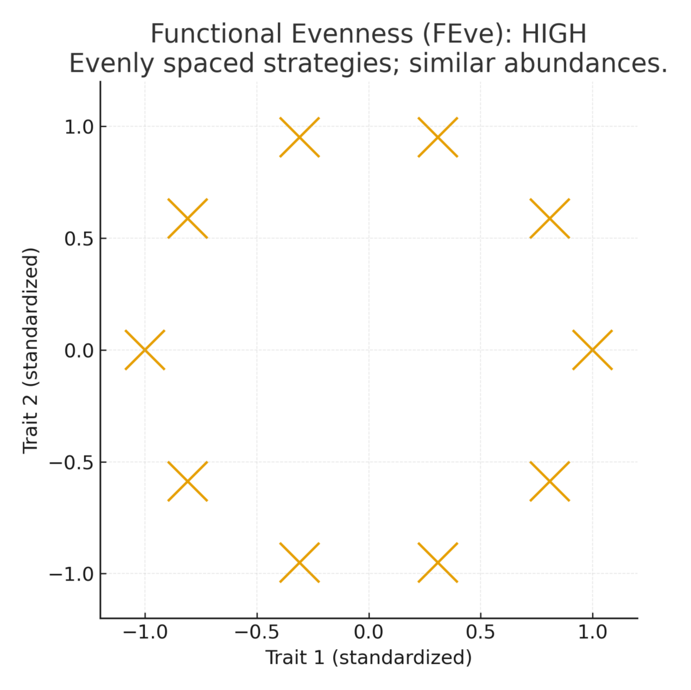
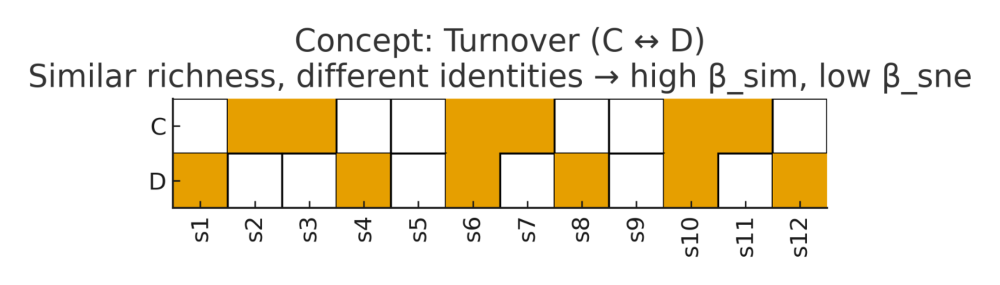
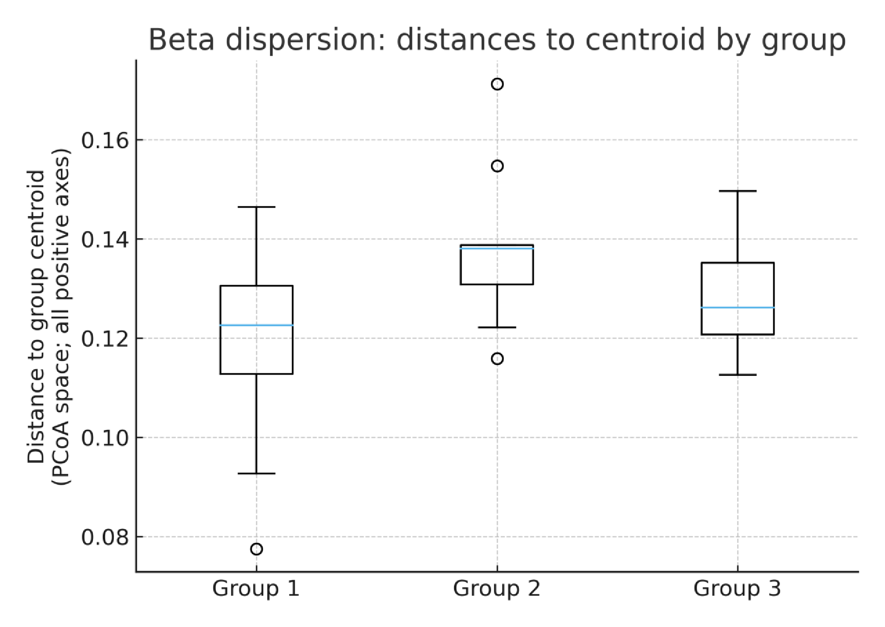
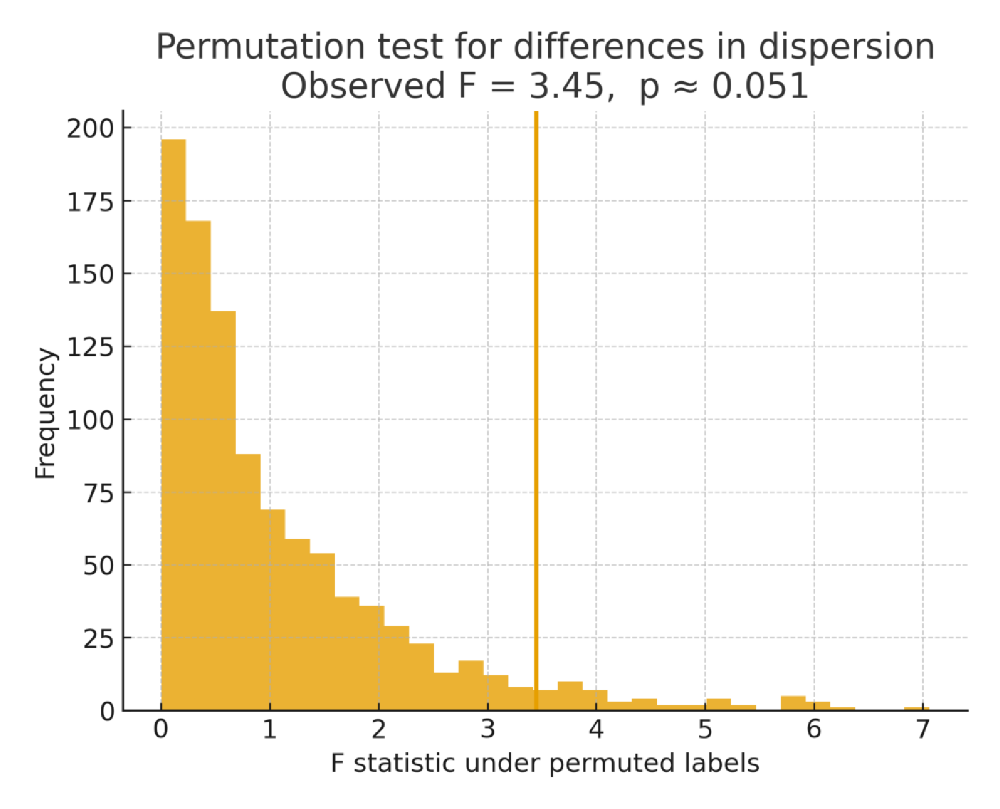

# Simulation-based hypothesis testing

##  Lecture summary: 

This chapter introduces model-based hypothesis testing with null and alternative hypotheses, simulation (permutation) to obtain an empirical null distribution, and interpreting p‑values. We then apply this to an ecological case study on hedgerows and bee communities, with a focus on trait differences and biodiversity metrics (α, β, γ).

###  Learning Objectives

By the end, you should be able to:

- Explain the **null** vs **alternative** model and choose a suitable **test statistic**.
- Simulate a **null distribution** and compute an **empirical p‑value**.
- Run an **A/B test** comparing two groups via permutation.
- Define and compute **alpha**, **beta**, and **gamma** diversity from sample data.
- Interpret results in an applied ecology setting (hedgerows vs controls).

###  Hypothesis testing

- **Models** are sets of assumptions about data; the question is **does the model fit?**
- **Null hypothesis**: a well‑defined probabilistic model for how data were generated; we can simulate data **under the null** to understand expected variation.  
- **Alternative hypothesis**: a different generative view; we choose a statistic whose large (or small) values favor the alternative.  
- **Assessing a model**: (1) choose a statistic; (2) simulate the statistic under the null; (3) compare the observed statistic to the simulated distribution (histogram).  
- **Conclusion**: If the observed statistic is inconsistent with the null distribution, the test **rejects the null** in favor of the alternative.  
- **p‑value**: the chance, **under the null**, of seeing the observed statistic or something **more extreme in the direction of the alternative**.

###  A/B testing
**What is A/B testing?**  
We compare outcomes between two conditions --- **A** (control; e.g., unrestored field edges) and **B** (treatment; e.g., hedgerows) --- to estimate a causal effect on a metric such as **species richness**.

**Design & notation.** Let groups be \(g\in\{A,B\}\). For site \(i\) in group \(g\), observe outcome \(Y_{ig}\) (e.g., Shannon diversity). A simple test statistic is the **difference in means**  
\[
 (T_{obs})= \bar{Y}_B - \bar{Y}_A 
\]

($\bar{Y}$ denotes average, pronouced y-bar)

**Randomization/permutation test.** To obtain a finite-sample null without distributional assumptions:

1. Compute the observed statistic ($T_{obs}$)  

2. **Shuffle** the group labels (respecting any blocks/years; see below) many times (e.g., 10,000 permutations).  

3. Recompute ($t_{sim}$) for each shuffle to form the **empirical null**, $T_{sim}$ 

4. The **two-sided p-value** is: `sum(abs(tsim) >= abs(Tobs))/nsim` or equivalently `mean(abs(T_perm) >= abs(T_obs))` (HINT: maybe it would be useful to write a function to use this euqation over and over again).

**Blocking and paired designs.** If sites are naturally paired (e.g., each hedgerow matched to a nearby control) or sampled across **years**, compute the statistic **within block/year**, then average across blocks. Permute **within** each block/year to preserve structure.

```{r child="demos/04-demo-abtest-co2.Rmd", echo=FALSE, error=TRUE}
```


### Biodiversity metrics: α, β, γ diversity
- **Alpha (α) diversity**: **within‑site** diversity (e.g., species richness per site). It captures local diversity at the sampling unit.  

**Richness (S or $^0$𝐷 )**

- Use when: You care about how many species (checklists, conservation targets for rarity).
- Emphasizes: Rare species heavily.
- Caveat: Very sensitive to sampling; always pair with rarefaction (simulate the hypothetical true richness based on species accumulation with survey effort) estimators or sample-coverage standardization.

**Shannon **

- \(H'=-\sum_i p_i\ln p_i\) [@Shannon1948]
- Use when: You want a balance of richness and evenness; you care about “typical” species.
- Emphasizes: Intermediate weighting—neither rare nor dominant species overly control the value.

**Simpson**

- \(1-\sum_i p_i^2\) [@Simpson1949]
- Inverse Simpson $^2$𝐷=1/(\sum_i p_i^2\)
- Use when: You care about dominance/common species. 
- Emphasizes: Down-weights rare species strongly.

**Hill numbers** 

We report Hill numbers to keep units in *effective species*:

- \(^{0}D\): richness (S)
- \(^{1}D = \exp(H')\): effective species corresponding to Shannon
- \(^{2}D = 1/\sum p_i^2\): inverse Simpson (down-weights rare species)

###  Functional diversity (trait-based)

**What is a functional trait?** 
A measurable species life history or phenotypic characteristic that influences performance: **body size**, **diet breadth/specialization**, **tongue length**, **phenology**, **nesting substrate**, etc.

Functional diversity: is the variation in organisms’ functional traits within a community—i.e., the breadth and distribution of ways species “make a living” and affect ecosystem processes. 

**Common trait diversity metrics**

- **Functional richness (FRic)** — volume of trait space occupied (convex hull) [@Villeger2008]. Usually trivially related to species richness ($\alpha$ diversity).
- **Functional evenness (FEve)** — how evenly abundances are distributed in trait space [@Villeger2008].  

{width=65%}

{width=65%}

- **Functional divergence (FDiv)** — degree to which abundances lie toward trait extremes [@Villeger2008].  

{width=65%}

{width=65%}

- **Functional dispersion (FDis)** / **Rao’s Q** — mean distance of individuals/species to the trait centroid [@Laliberte2010; @Rao1982]. Can be thought of as Functional richness but standardized for species richness.

{width=65%}

{width=65%}

**Interpretation guide** 

- Higher **FRic/FDis**: broader strategies; potential for complementarity.
- Higher **FEve**: reduced dominance by a single strategy; balanced species functions.  
- Higher **FDiv**: niche differentiation; extremes well represented.

**Traits as mechanisms.** Certain habitat types may shift **functional trait** composition (e.g., body size, nesting substrate, diet breadth), increasing **functional divergence** and **evenness**, which can **increase β** by promoting niche differentiation. 

### Beta diversity (among-site turnover)

- **Beta (\(\beta\)) diversity**: *compositional variation among sites* (how different communities are). 
- **Gamma (γ) diversity**: **regional** or pooled diversity across all sites in the study.  

Traditional calculation: 

  1. **Multiplicative** [@Whittaker1972]: \(\beta_W = \dfrac{\gamma}{\bar{\alpha}}\) 
  2. Additive: \(\gamma - \bar{\alpha}\)).  

**Community Nestedness vs. Turnover (Replacement)**

- **Nestedness**: communities with fewer species are **subsets** of richer ones (shared core + losses).  
  - Metric: **NODF** — Nestedness based on Overlap and Decreasing Fill [@AlmeidaNeto2008].
- **Turnover (replacement)**: differences across sites occur because **species are replaced**, not just lost.  
  - Partitioning \(\beta\) into **turnover vs. nestedness** components clarifies processes [@Baselga2010].

**Why it matters**  
- If patterns are **nested**, filters or gradients produce orderly species loss.  
- If patterns show **turnover**, environments/resources are heterogeneous; restoration may create distinct assemblages.  
- Elevated β with little nestedness \(\Rightarrow\) **replacement** is the dominant driver.


{width=65%}

{width=65%}


**Multivariate dispersion workflow**

1. Compute a site-by-site dissimilarity matrix (e.g., Bray–Curtis for abundance).[@Anderson2006]

{width=65%}

2. Ordinate (PCoA).

{width=65%}


3. Compute distances of sites to their **group centroid** in the full positive-eigenvalue space.

{width=65%}


4. Compare mean distances among groups via permutations of group labels (betadisper).

{width=65%}


**What's a dissimilarly matrix?**
A **dissimilarity matrix** (aka distance matrix) stores **pairwise differences** among *n* sites. It is an *n × n* square matrix with:

- **Zero diagonal**: distance of each site to itself is 0.  
- **Symmetry**: \(d(i,j) = d(j,i)\).  
- **Scale**: often in \([0,1]\) for indices like **Bray–Curtis** (0 = identical, 1 = completely different).

We measure abundance of three bee species at three sites:

| Species | Site1 | Site2 | Site3 |
|:-------:|:-----:|:-----:|:-----:|
| Bee_A   |   5   |   0   |   2   |
| Bee_B   |   3   |   4   |   1   |
| Bee_C   |   2   |   6   |   7   |

We’ll use **Bray–Curtis dissimilarity** between two sites \(x\) and \(y\):
\[
\mathrm{BC}(x,y) \;=\; \frac{\sum_i |x_i - y_i|}{\sum_i (x_i + y_i)} \,.
\]

|         | Site1 | Site2 | Site3 |
|:-------:|:-----:|:-----:|:-----:|
| Site1   |   0     |   0.5   |   0.5   |
| Site2   |   0.5   |   0     |   0.3   |
| Site3   |   0.5   |   0.3   |   0     |

If you ever need to calculate dissimilarity in R, use the `vegdist` function in the package `vegan`. 

**When to use which dissimilarity?**

- **Bray–Curtis** (abundances): robust, ignores joint absences, common for β‑diversity.  
- **Jaccard / Sørensen** (presence–absence): use when only detection/non-detection is reliable.  

###  Biotic homgenization and traits

**Biotic homogenization** means communities become **more similar** over space or through time (i.e., **β‑diversity decreases**). In the hedgerow context, the hypothesis is that restoration **counteracts homogenization** by creating habitat heterogeneity that supports distinct species sets across sites.

**Ecological (environmental) filtering**: abiotic and biotic conditions of a habitat *select* species/traits that can persist, favoring some strategies and excluding others. Filtering helps explain shifts in community composition and trait distributions across environments (see general synthesis in [@Legendre2012]).

- Ex: In conventional margins, frequent disturbance/resources may filter for **small, generalist, ground‑nesting** bees.  
- Restored **hedgerows** can **relax** filters, allowing a *wider trait set* and greater community heterogeneity.

---

```{r child="readings/04-reading.Rmd", echo=FALSE, error=TRUE}
```

---

```{r child="labs/04-lab-hedgerows_student.Rmd", echo=FALSE, error=TRUE}
```