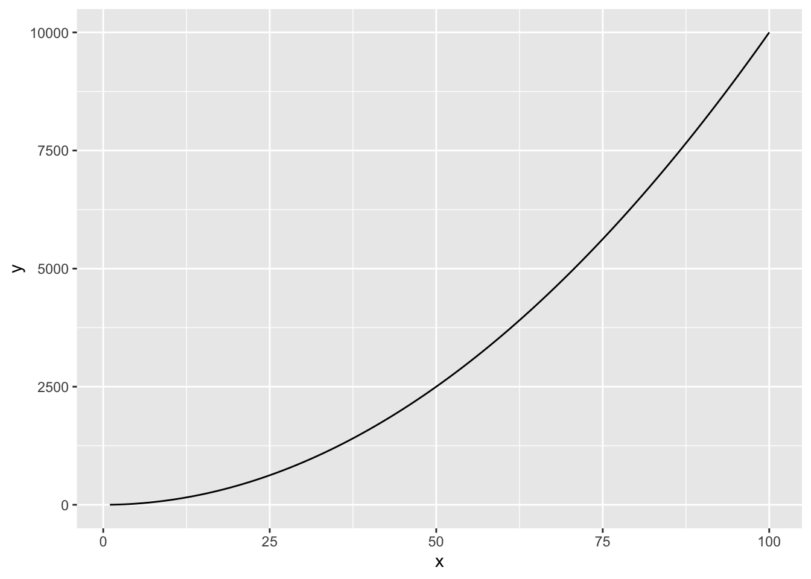

# Key Programming Concepts

## Lecture summary

This chapter builds a foundation for writing clear, reliable R code you can reuse across labs and projects. In lab we will practice these skills and discuss the weekly reading, Alston et al. 2020. A Beginner's Guide to Conducting Reproducible Research.

###  Learning objectives

By the end of this chapter, you will be able to:

- Distinguish **objects**, **functions**, and **expressions** in R, and use assignment idioms confidently.
- Work with core **data structures** (vectors, matrices/arrays, lists, and data frames) and explain when to use each.
- Use **control flow** (`if`, `for`) and the **apply** family to write clear, vectorized code.
- Write and call **functions** with arguments and return values; document intent with informative names.
- Perform basic **Boolean logic** and use logical indexing for subsetting.
- Read R help, search effectively, and follow reproducible coding practices you’ll build on all term.

###  Why programming concepts matter

Across languages, programming is built from a small set of ideas that you will reuse constantly. Greg Wilson (Software Carpentry) popularized a helpful list of seven: 

1.  Individual things (the number 2, the character 'hello')
2.  Commands that operate on things (the + symbol, the `length` function)
3.  Groups of things (R vectors, matrices, lists, dataframes, and arrays)
4.  Ways to repeat yourself (for and while loops, apply functions)
5.  Ways to make choices (if and try statements)
6.  Ways to create chunks (functions, objects/classes, and packages)
7.  Ways to combine chunks (piping) 

In this course we focus on doing these in **R** for ecological and conservation data.

###  Objects and basic types

In R, everything you create is an **object** that lives in your Global Environment. Objects have **classes** (e.g., numeric, integer, character), and functions behave differently depending on the class. Numbers come in two common flavors: `integer` and `numeric`. Numerics have very high—but finite—precision (about 15–16 decimal places). Text is stored as **character** strings, e.g., `"hello world"`.


###  Assignments vs. expressions

An **expression** *is* a thing; a **statement** *does* a thing. In R, you bind a name to a value with the assignment arrow: `hours_per_wk <- 168`. Read that as “make `hours_per_wk` refer to 168,” not as a math equation.


###  Functions and operators

A **function** is a reusable action you call by name, like `max(15, 27)`. Functions take **arguments** and often **return** a value. Many mathematical symbols are just functions in disguise (operators), e.g., `x + y` calls the `+` function. You can and should write your own functions to package work you do often.


###  Core data structures

You will manipulate collections of values constantly:

- **Vector**: a one-dimensional sequence where every element has the same class. Arithmetic is *vectorized*—it applies element-by-element.
- **Matrix**: a 2-D array (rows × columns) of a single class.
- **Array**: the N-D generalization of a matrix.
- **Data frame**: a table whose columns can be different classes but must all be the same length. Each row is an observation; each column is a variable.
- **List**: an ordered bag of components that can be different sizes and classes. A data frame is a special kind of list where all components are equal length.

###  Comparisons and boolean logic

Comparisons produce **logical** values: `TRUE` or `FALSE`. Operators include `>`, `>=`, `==` (equal), and `!=` (not equal); combine them with `&` (and) or `|` (or). Logical vectors are powerful: `sum(c(TRUE, FALSE, TRUE))` returns 2 because `TRUE` is 1 and `FALSE` is 0. 


###  Control flow: `if` and `for`

Control statements direct the path of your code. Use `if (...) { ... } else { ... }` to make choices, and `for (name in collection) { ... }` to repeat work for each element. Indentation isn’t required by R, but using it makes your intent clear. 


###  The *apply* family (vectorized repetition)

Many tasks that could be written with `for` loops are more concise and often faster with the *apply* family: `apply()` (arrays/matrices), `lapply()` (returns a list), `sapply()` (simplifies when possible), `mapply()` (multiple inputs), and `mclapply()` (parallel). Each takes a `FUN` argument—the function to apply to each element. 


###  Writing your own functions

Encapsulate a task by defining a function:

```r
spread <- function(values) {
  out <- max(values) - min(values)
  return(out)
}
```

Well-named functions make analysis pipelines clearer, easier to test, and reusable. 


###  Combining steps with pipes

Pipes let you express “do X, then Y, then Z” by chaining operations. We will pipe `%>%` from the tidyverse. You’ll see more next week when we start building data-wrangling workflows. 


###  R vs. Python: a quick orientation

R emerged from statistics; Python from computer science. Both are open-source and widely used in data work. We’ll use R throughout this course, but the concepts above transfer between languages. 

An annoying difference Python users will struggle with at first: in R, the syntax for calling a **function** and a **method** looks the same (because most things are functions), whereas Python distinguishes `data.plot` from `plot(data)`. 


## Demo: Exponential Population Growth 

> **Learning goals (today)**  
> • Simulate **deterministic exponential growth**.  
> • Explore how **initial size** \(N_0\) and **growth rate** \(r\) shape trajectories.  
> • Compute **doubling time** \(T_d = \ln 2 / r\) and **time to reach a threshold**.  

### Exponential population growth model

Exponential growth assumes the population changes proportionally to its current size:
\[
N_t \;=\; N_0 \, e^{r t},
\]
where \(N_0\) is the initial size and \(r\) is the **per‑time growth rate**.

- **Doubling time:** \(T_d = \dfrac{\ln 2}{r}\) (time until \(N_t\) doubles).  
- **Time to threshold \(N^\*\):** \(t^\* = \dfrac{\ln(N^\*/N_0)}{r}\).

---

### Simulate & plot a single scenario


First we will write a function to compute the population size and time step t. 


Set parameters (tweak live to show effects of **N0** and **r**):


```
##   t        N
## 1 0 50.00000
## 2 1 54.16435
## 3 2 58.67554
## 4 3 63.56246
## 5 4 68.85639
```

Plot the trajectory:


Compute **doubling time** directly from `r`:


```
## [1] 8.66434
```

Compute **time to threshold** \(N^\* = 10{,}000\) (can change this number to explore different dynamics):


```
## [1] 66.22897
```

---

### Compare two growth rates 

Side‑by‑side curves make the influence of \(r\) obvious.


**Observation.** Small changes in \(r\) cause large differences later in time.

---

### In class challenge

1) Change `r` to from a number < $-1$ to a number $>$ 1, trying 10 different numbers. HINT: use a for loop.  Describe what the different `r` do to the population dynamics. 
2) Another type of "population" can grow exponentially is the population of infected individuals. We have a separate model for their growth known as SIR models (susceptible-infected-recovered), but when a infectious disease is first introduced to a population, it grows exponentially because no one is immune (i.e., via getting sick and recovering or getting vaccinated) `r`.  Explore the population trajectory of measles if no one in Eugene were vaccinated, and one infected person was introduced (N0=1). How long would it take for the entire population of  178,786 to be sick? 

{width=60%}


##  Discussion & Reflection — Reproducible Research Alston & Rick (2020)

**Reading:** Alston, J.M. & Rick, J.A. (2020). *A Beginner’s Guide to Conducting Reproducible Research*. **Bulletin of the Ecological Society of America**, 102(2): e01801. https://doi.org/10.1002/bes2.1801

<div style="margin: 1rem 0;">
<embed src="readings/reading-Alston2020.pdf" type="application/pdf" width="100%" height="800px" />
</div>

---

### Pre‑class reflection (please submit short answers via canvas)

1. In your own words, what does **computational reproducibility** mean? Give one concrete example from your work or coursework where results would *not* be reproducible without extra effort.
2. List **two benefits to you** (the analyst) and **two benefits to the community** of making your work reproducible.
3. Which barrier feels most real for you right now: **complexity**, **technological change**, **human error**, or **intellectual property**? Explain with a 2–3 sentence example.
4. Commit to **one specific step** you will implement in your current/future research (student thesis, etc.) (e.g., a file‑naming scheme, a README template, version control, dynamic documents). Why this step?

---

### In‑class small‑group prompts

*Before analysis:* data storage & organization:

- Sketch a **project folder layout** for the current/next lab (e.g., `data-raw/`, `data/`, `R/`, `figs/`, `doc/`).  
- Decide what belongs in **raw** vs **clean** data; outline a **metadata** plan (variables, units, data provenance).  
- Propose a **backup strategy** (locations, frequency) and a **file‑naming convention** that encodes version/date.

**Human error scenarios**
Consider: a collaborator overwrites a cleaned dataset; a figure is updated but not the manuscript numbers; code runs only on one laptop.  

- For **each**, describe how a reproducible workflow would **prevent or catch** the issue.

**Reproducibility checklist**

- Draft a **reproducibility checklist** (6–10 items) tailored to the current lab or for this class's final project. 

**Final thoughts** 

- One **question** you still have.  


## Lab: Programming Key Concepts


### Lesson Overview

The goals of this modules is to refine your knowledge of the basic, core concepts of programming that transcend languages, how they fit together, and how you can use them to become a better scientist. We will practice these concepts by modeling the logistic growth of a population. 

**Conservation/ecology Topics**

- Simulate population dynamics under logistic growth, and how a catastrophes alter those dynamics. 

**Computational Topics**


By the end of this R lesson, you will be able to:

-  Gain familiarity with the 6 of the 7 core elements shared by all
    programming languages.
-  Use R to write simple functions that use these core elements.
-  Make and save simple plots using basic plots.

We encourage you to make liberal use of your fellow students, GE, and professor as we proceed through these modules. We will work in pairs. 

### Review: The Seven Core Concepts

As noted by Greg Wilson (the founder of Software Carpentry), every
programming language shares seven core elements:

1.  Individual things (the number 2, the character 'hello')
2.  Commands that operate on things (the + symbol, the `length` function)
3.  Groups of things (R vectors, matrices, lists, dataframes, and arrays)
4.  Ways to repeat yourself (for and while loops, apply functions)
5.  Ways to make choices (if and try statements)
6.  Ways to create chunks (functions, objects/classes, and packages)
7.  Ways to combine chunks (piping) (for next week)

### Starting with RStudio

To open RStudio, click on the RStudio icon in the Applications (if you
are on a Mac) or in your Programs if you are on Windows.

There are four windows in RStudio that we will refer to throughout the
workshop

1. *The R Script*: Typically the upper left hand corner of RSutdio.
   This is where you write R code that you can save and reuse later.
2. *The R Console*: Typically in the lower left hand corner. This is
   where you execute R code.
3. *The R Environment*: Typically in the upper right hand corner. This
   is where you can see defined variables.
4. *R "Information"*: Typically in the lower right hand corner. This
   is where you see plots, help and other R information.

For all the work in this class we will be typing code in the R
script and then executing it in the R console.  For simple commands
(e.g. `2 + 2`) this may seem stupid, but writing in a script will help
all of your work be reproducible! Think of the script as your lab
notebook.

**TIP**: Some helpful R studio shortcuts
1. Run the current line of selection
   - Windows: `Ctrl-Enter`
   - Mac: `Command-Enter`
2. Source the entire script
  - Windows: `Ctrl-Shift-Enter`
  - Mac: `Command-Shift-Enter`

###  Individual things

The most basic component of any programming language are "things",
also called variables or objects.

The most common basic "things" in R are numerics, characters,
logicals, and some special objects of various types (e.g. lists,
dataframes, etc.). We'll meet many of these as we go through the
lesson.


```
[1] 2
```

```
[1] "hello"
```

###  Assignment statements 
Things can be stored as variables using `<-`.  `=` also works, but R
programmers are picky about `<-` sometimes called "carrot". 


```
[1] 2
```

```
[1] "hello"
```

```
[1] TRUE
```

We can figure out the type of these things using the `class` function

```
[1] "numeric"
```

```
[1] "character"
```

```
[1] "logical"
```
    
### Question 1: Population dynamics

Logistic growth of a population: Throughout this lesson, we will successively build towards calculating the logistic growth of a population of bees in a meadow (or some less exciting vertebrate, if you prefer).

A commonly used discrete time equation for logistic population growth is

 $$n(t + 1) = n(t) + r*n(t) [1 - n(t) / K]$$

where n(t) is the population size at time t, r is the net per capita growth rate, and K is the carrying capacity of the habitat.

To get started, write R expressions that do the following:

- 1a. Create variables for `r`, `K`, and `n0`, setting these equal to 0.6, 100, and 10, respectively.


###  Commands that operate on things

Just storing data in variables isn't much use to us. Right away, we'd like to start performing operations and manipulations on data and variables.

There are three very common means of performing an operation on a
thing.

**Use an operator 

All of the basic math operators work like you think they should for
numbers. They can also do some useful operations on other things, like characters.


```
[1] 5
```

```
[1] 6
```

```
[1] 8
```

```
[1] 0.6666667
```

```
 [1]  1  2  3  4  5  6  7  8  9 10
```

**Use a function

A function is a block of code with a specific input(s) and output. There are thousands of functions that operate on things.

```
[1] "numeric"
```

```
[1] 3
```

```
[1] 3
```

```
[1] "3.3 rounded is 3"
```

To find out what a function does, type the `?` before the function
name.


```
[1] 4.6
```

> **Tip**: Sometimes the R help can be pretty unhelpful.  The best
> option then (or maybe before you even use the R help, is to Google
> it!). Here are a list of sites that we find very helpful:

> 
>   1. [Stack Overflow](http://stackoverflow.com/)
>   2. [R for Data Science](http://r4ds.had.co.nz/)

Many useful functions are in external packages and you need to install
them and load them into the R environment.  For example, what if we
wanted to figure out how to do a negative binomial regression in R?


```
Loading required package: Matrix
```

Hmmm, that probably didn't work for you because the function lives in an external package called `lme4`.  We need to install package and then load the package.


There are thousands of R packages with many useful functions and
datasets!  That is one of the huge advantages of R, everyone can
contribute.

###  Question 2: Using operators and functions

- 2a. Create the variable `n1` (n at t=1) and calculate it's value using the logistic growth equation Do the same for `n2` and `n3`.

 n(t + 1) = n(t) + r*n(t) [1 - n(t) / K]


- 2b. Check the type of `n2` - what is it?


- 2c. Modify your calculations for `n1`, `n2` and `n3` so that these values are rounded to the nearest integer (so no decimal places). If you have forgotten the name of the function that rounds numbers, try googling it (or look back at the lecture demo above). If you are unsure of the arguments to the function, check the help file using ?


    
###  Groups of things
**Vectors 1D** 
We can create groups of things with functions. A simple group is a vector, similar to a column of data.


```
[1] "Monday"    "Tuesday"   "Wednesday" "Thursday"  "Friday"   
```

```
[1]  99.9 100.0  98.7  20.0
```

**Matrices 2D**

All elements must be the same class. Matrices are great for storing the results of simulations (like what we will be doing today).


```
      [,1] [,2] [,3] [,4] [,5] [,6] [,7] [,8] [,9] [,10]
 [1,]    0    0    0    1    1    1    0    1    1     0
 [2,]    1    0    0    1    1    0    1    1    1     0
 [3,]    0    0    0    0    0    1    1    0    0     1
 [4,]    0    0    0    1    1    1    1    0    0     1
 [5,]    1    0    0    0    1    0    1    0    0     0
 [6,]    0    1    0    0    1    0    1    1    1     0
 [7,]    0    1    1    1    1    1    1    1    0     0
 [8,]    0    1    0    0    1    1    0    0    1     1
 [9,]    1    1    0    1    0    1    1    0    0     1
[10,]    1    0    1    1    0    0    1    1    1     0
```

**Dataframes 2D**

Dataframes can have columns of different classes. We will not be using dataframes today, but most data is stored in dataframes because data for a project is not either all numeric or characters.


```
[1] "yes" "no" 
```

```
[1] "character"
```

```
[1] 3.1 2.1
```

```
[1] "numeric"
```

**Lists, N-dimensional**

Lists can have components of different dimensions and classes. Dataframes are special lists where all the components are vectors with the same length. We will not be using these today but they may be relevant for your final projects because they are so flexible. 


```
      [,1] [,2] [,3] [,4] [,5] [,6] [,7] [,8] [,9] [,10]
 [1,]    0    0    0    1    1    1    0    1    1     0
 [2,]    1    0    0    1    1    0    1    1    1     0
 [3,]    0    0    0    0    0    1    1    0    0     1
 [4,]    0    0    0    1    1    1    1    0    0     1
 [5,]    1    0    0    0    1    0    1    0    0     0
 [6,]    0    1    0    0    1    0    1    1    1     0
 [7,]    0    1    1    1    1    1    1    1    0     0
 [8,]    0    1    0    0    1    1    0    0    1     1
 [9,]    1    1    0    1    0    1    1    0    0     1
[10,]    1    0    1    1    0    0    1    1    1     0
```

You can create an empty vector with `vector()`. (By default the mode
is `logical`, but that can be changed to any class of thing you need). 


```
 [1] "" "" "" "" "" "" "" "" "" ""
```

You can add elements to vectors as well using `c()`


```
[1] 0 2
```

```
 [1]  1  2  3  4  5  6  7  8  9 10
```

```
 [1]  0  2  1  2  3  4  5  6  7  8  9 10
```
    
You can then look at specific things in the vector by specifying the *index*


```
[1] 0
```

```
[1] 2 1 2 3
```

```
[1] 9
```

You can also make vectors of number sequences


```
 [1]  1  2  3  4  5  6  7  8  9 10
```

```
 [1]  0.0000000  0.4166667  0.8333333  1.2500000  1.6666667  2.0833333
 [7]  2.5000000  2.9166667  3.3333333  3.7500000  4.1666667  4.5833333
[13]  5.0000000  5.4166667  5.8333333  6.2500000  6.6666667  7.0833333
[19]  7.5000000  7.9166667  8.3333333  8.7500000  9.1666667  9.5833333
[25] 10.0000000
```

###  Question 3: Storing and indexing data

- 3a.  Create a vector where `n0`, `n1`, `n2` and `n3` are stored, instead of as separate individual variables by creating an empty vector using the syntax `n <- vector("numeric", 4)`, and then assigning each index. You could get the same result using `c()`, but practice using `vector()` and indexing instead.


- 3b. Get the first and last values in the vector, calculate their ratio, and print out "Grew by a factor of" followed by the result.


- 3c. Extract the last value of your n vector in two different ways: first, by using the index for the last item in the vector, and second, with out "hard coding" the index and instead using a function to work out the index for the last element.  HINT: the `length()` function may be useful.


###  Comparisons and Booleans
**Comparison operators** 
Comparison (also called logical) operators compare two things. This amounts to asking R a question

1. `x > y`: R, is x greater than y?
2. `x == y`: R, is x the same as y?
3. `x <= y`: R, is x less than or equal to y?
4. `x & y`: R, are both x and y `TRUE`?
5. `x | y`: R, is either x or y `TRUE`?

R will either answer `TRUE` or `FALSE`


```
[1] FALSE
```

```
[1] TRUE
```

```
[1] FALSE
```

```
[1] "logical"
```

```
[1] TRUE
```

```
[1] TRUE
```

```
[1] FALSE
```

You can also use comparisons to subset vectors or matrices. This is called logical indexing.  For example, let's get an vector that only contains values greater than 2


```
[1] 1 2 3 4
```

```
[1] 3 4
```

```
     [,1] [,2] [,3] [,4] [,5]
[1,]    1    3    5    7    9
[2,]    2    4    6    8   10
```

```
[1]  3  4  5  6  7  8  9 10
```

**Aggregating comparisons**


```
 [1] FALSE FALSE FALSE  TRUE  TRUE  TRUE FALSE  TRUE  TRUE FALSE
```

```
[1] 5
```

###  Question 4: Storing data and logical indexing

- 4a.  Pre-allocate an vector called n containing 100 blank space (i.e. 0s) as if we were going to fill in 100 time steps. 


- 4b. Imagine that each discrete time step actually represents 1 day. Create an vector `t` storing 100 time step from 2 to 100. For example, `t[1]` should be 2 `t[2]` should be 3, etc.


- 4c. Use the logistic growth equation to fill in the first 5 elements of n by hand. Assume the initial population size at t=1 is 10. 

Logistic growth equation:
n(t + 1) = n(t) + r*n(t)[1 - n(t) / K]


Rather painful! Hard to imagine we could fill in the rest without making a mistake with our indexing. In the next Question of the lab we will learn how to repeat ourselves without copy-pasting like in the above.

- 4d. Use logical indexing to extract the value of `n` corresponding to a `t` of 3.


### Control statements - for (repeating yourself)

In this section and the next, we really start to take advantage of the power of programming languages to do things for us automatically.

We start here with ways to repeat yourself. For loops in R are useful when you want to cycle over all of the items in a collection (such as all of the elements of a vector). 


```
[1] "o *"
[1] "x *"
[1] "y *"
[1] "g *"
[1] "e *"
[1] "n *"
```

What is the value of char?


```
[1] "n"
```

You can sum a collection of numbers with a loop (though this could be more quickly done using a `sum()`, but just for example purposes.


```
[1] 85
```
    
We often want to loop over indexes of collections


```
[1] 1 2 3
```

```
[1] "hi"
[1] "hello"
[1] "bye"
```
    
Once we start looping through large numbers of values it is often better to plot the data.  We will cover this in much more detail next week, but here is a quick example.



###  Question 5: Using loops to repeat calculations

Exciting next step, let's get smart about our calculations of `nt`. Building on what you did in Question 5, do the following:

- 5a. Write a for loop to fill in the values of `nt` for 100 time steps.  Loop over the values of the t, and use each step vector to index the vector `n`. (Why does the t vector start at 2 and not at 1?)


- 5b. Plot the vector `n`. HINT: You will want t to start at 1 for the plot so it can include n(1) which we set above but did not include in the for loop because you need to start with an initial population before growing logistically. 


- 5c. Play around with the values of `r` and `K` and see how it changes the plot. What happens if you set `r` to 1.9?


- 5d. What happens if you set `r` to 3?


### Control statements - if (making choices)
Often we want to check if a condition is `TRUE` and take one action if it is, and another action if the condition is `FALSE`. We can achieve this in R with an if statement.

You can use any expression that returns a boolean value (`TRUE` or `FALSE`) in an if statement. 

**if and else** 

```
[1] "not greater"
```

```
[1] "done"
```

Conditional statements don’t have to include an else. If there isn’t one, R simply does nothing if the test is FALSE. 


```
[1] "before conditional..."
```

```
[1] "107  is greater than 100"
```

```
[1] "...after conditional"
```

We can also chain several tests together using else if{}
The following R code uses else if to print the sign of a number.


```
[1] "42 is positive"
```

```
[1] "all done"
```

We can also combine tests using and and (&) or (|). and is only true if both Questions are TRUE:


```
[1] "at least one Question is false"
```

Or TRUE if one or the other Question is TRUE:


```
[1] "at least one test is true"
```

###  Question 6: Making the model stochastic with an if statement

Let's introduce some element of randomness into our logistic growth model to better represent nature. We'll model a simple "catastrophe" process, in which a catastrophe happens in 10% of the time steps that reduces the population back down to the size at n0. For example, the bees in our meadow have some probability of being sprayed by herbicide that drifts from nearby timber plantations which would kill individuals directly and through starvation (no flowers left). Build on your code from Question 4 into the box below, and do the following:


- 6a. Create a variable called `cata`, for catastrophe, that will be `TRUE` if a catastrophe has occurred, and `FALSE` if it hasn't. A simple way to do this is to generate a random number using `runif(1)` (draw from a uniform 0,1 distribution once, see ?runif), which will give you a random number between 0 and 1. Check whether this number is less than 0.1 - this check will be `TRUE` 10% of the time.


- 6b. Using your logical variable `cata`, add an if statement to your for loop that checks whether `cata` is true in each time step.  If it is true, set the population back to the size at n[0]. Otherwise, perform the usual logistic growth calculation.
HINT: `cata` will need to be within the for loop so it change values each iteration.


- 6c. Plot your results. Run the code again to see a different growth trajectory.


d. Now that you have the vector `n`, count the number of time steps in which the population was above 50. Although you can do this with a for loop (loop through each value of `nt`, check if it is > 50, and if so increment a counter), you can do this in one line with a simple logical operation. HINT: If you take the sum of a logical vector (using `sum()`), it will give you the number of `TRUE` values (since a `TRUE` is considered to be a 1, and False is a 0).


###  Creating chunks
**Writing functions**
One way to write a program is to simply string together commands, like the ones described above, in a long file, and then to run that file to generate your results. This may work, but it can be cognitively difficult to follow the logic of programs written in this style. Also, it does not allow you to reuse your code easily - for example, what if we wanted to run our logistic growth model for several different choices of initial parameters?

The most important ways to "chunk" code into more manageable pieces is to create functions and then to gather these functions into modules, and eventually packages The R packages that you download from CRAN essentially contain collections of functions, though they also contain datasets and high level chunks called objects. Below we will discuss how to create functions in R. Functions are good for making code more **reusable**, **readable**, and **maintainable**.

We can create a function to do whatever we like. We need to give it a same, define its inputs (arguments) and its outputs (return expression). 


```
[1] 99
```

Another example: 


A function has a few crucial Questions

1. A name (`fahr_to_celsius`)
2. Arguments (`temp`)
3. A return value (`celsius`).  One feature unique to R is that the return statement is not required. R automatically returns whichever variable is on the last line of the body of the function. But, is it makes it much easier to understand a function if a return statement is defined explicitly so its best practice to include one.

Next, we get to use the function. You pass in *arguments* to the function. 
    

```
[1] 0
```

```
[1] 100
```

You **always** want to document your function to describe what it does.  You can do that with comments. Use full sentences and describe the inputs and outputs.


Functions can also have default parameters, which don't need to be passed as arguments when the function is called. Beginning with a function with no defaults:


```
[1] "Good afternoon friends"
```

What happens when you try this


You must pass in two arguments because that is how you defined the function! If we were writing a function many people might use, we would want to check the inputs were correct (known as "defensive programming") instead of letting R throw an error. 
Let's now give `people` a default value.  In the example below, people will now have the value of `world` unless we explicitly specify otherwise.


```
[1] "Good afternoon world"
```

```
[1] "Good afternoon students"
```

###  Question 7: Creating a logistic growth function

- 7a. Finally, let's turn our logistic growth model into a function that we can use over and over again.  Let's start with writing a function to calculate n(t+1). It should take n(t), r, and K as agrguments and return n(t+1). 

Reminder of the logistic growth equation:
 n(t + 1) = n(t) + r*n(t) [1 - n(t) / K]
 

 
- 7b. Create function called `logistic_growth` that takes four arguments: `r`, `K`, `n0`, `p` (the probability of a catastrophe), and nsteps (the length of the t vector). Make `p` a default argument with a default value of 0.1. Have your function recreate your answer for question 7b above (simulate a catastrophe, grow the population if no catastrope occurs). Have your function return the `n` and `t`  matrix.
 
- 7c. Write a nice comment describing what your function does. In addition, use comments with full sentences to describe the intention of each section of code. 


- 7d. Call your function with different values of the parameters to make sure it works.

Store the returned results and make a plot from it.


- 7e. Explore different values of p and see how it changes the trajectory. Describe what happens.
ANSWER: .... 

### Question 8 (Extra credit or graduate students)

** Analyze and simulate a discrete-time predator–prey system.
1) simulate dynamics for two parameter sets,
2) visualize trajectories in time 

We use logistic prey growth, a linear functional response, and linear predator mortality:
\[
\begin{aligned}
N_{t+1} &= N_t + r\,N_t\left(1-\frac{N_t}{K}\right) - a\,N_t P_t,\\
P_{t+1} &= P_t + e\,a\,N_t P_t - m\,P_t,
\end{aligned}
\]
where \(N_t\) = prey abundance, \(P_t\) = predator abundance, and parameters \(r,K,a,e,m>0\).

### Simulate & visualize (baseline)

- 8a: Use the parameter set below and initial conditions \(N_0=100,\;P_0=20\). Simulate for \(T=200\) steps. Make a time-series plot of \(N_t\) and \(P_t\)

- 8b: Repeat the simulation with **higher predator mortality** \(m=0.28\) (others unchanged). Compare the dynamics to part (a) including the visualization. 

- 8c: What phenomenon of predator-prey dynamics does this illustrate? 
