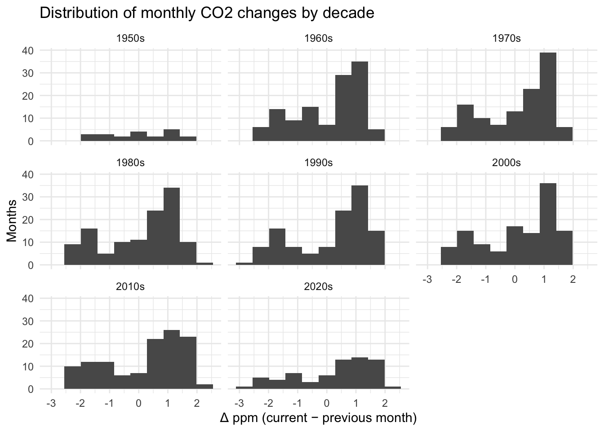
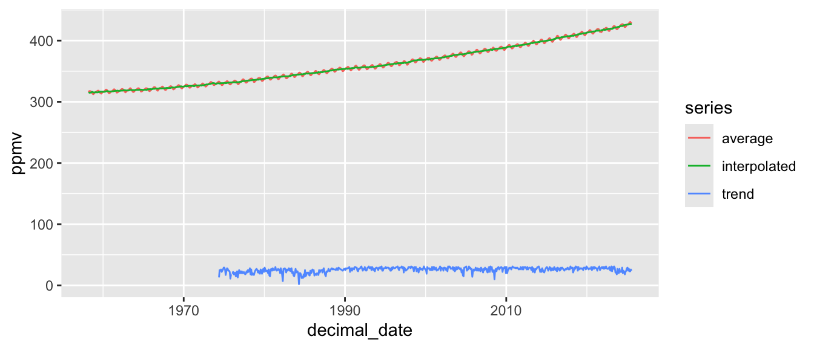
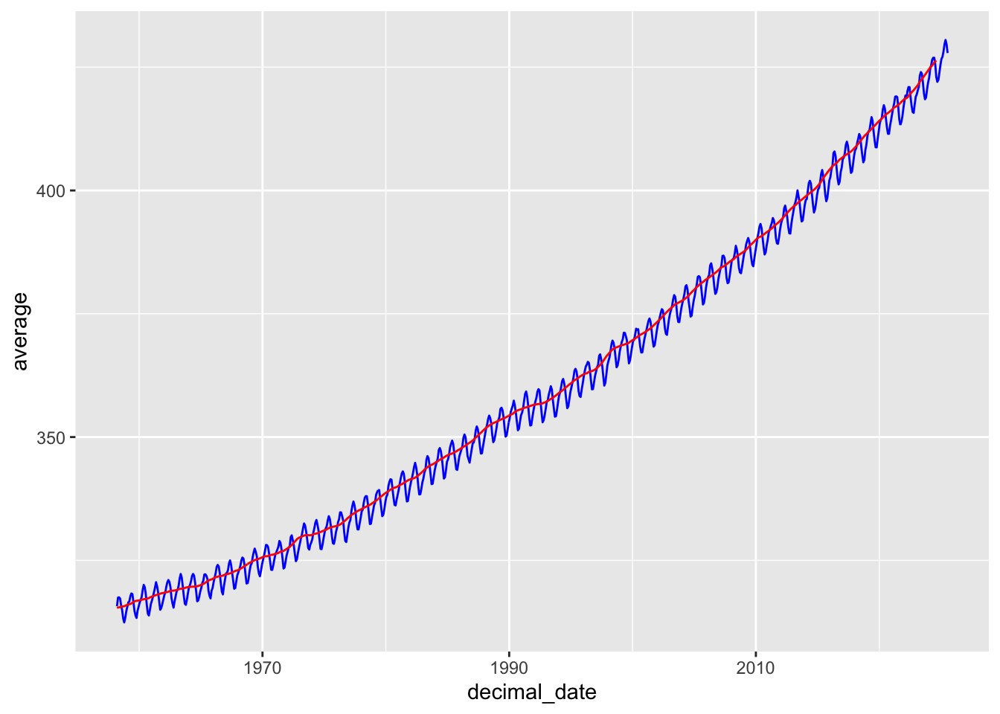
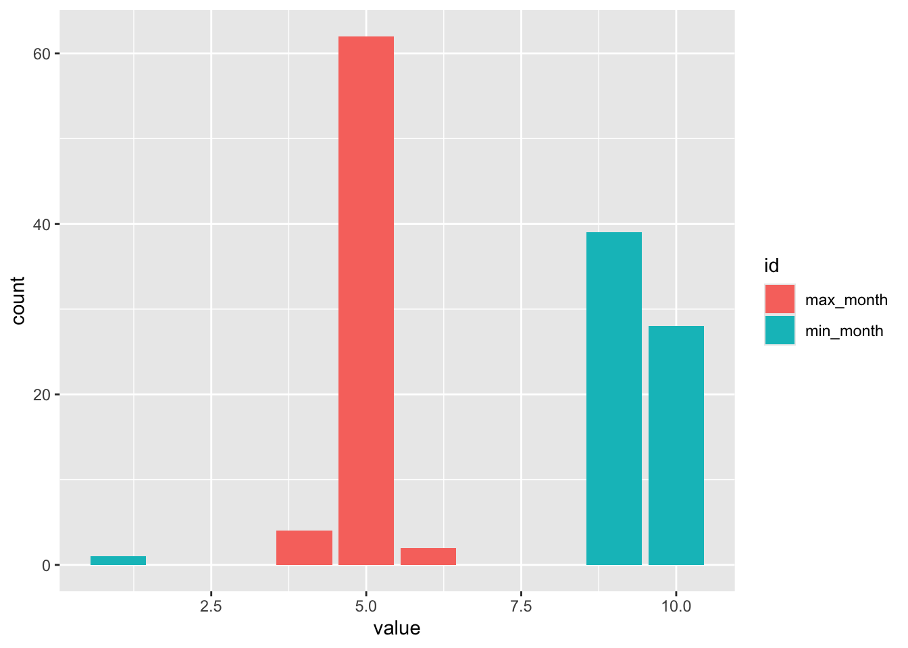

# Using "The Tidyverse" for data manipulation and visualization

## Lecture summary

This chapter introduces the Tidyverse as a coherent grammar for data—wrangling with dplyr (`filter()`, `select()`, `mutate()`, `summarise()`, `group_by()`), reshaping with tidyr (`pivot_longer()`, `pivot_wider()`), joining relational tables, and visualizing with `ggplot2`. We build readable pipelines with the pipe, emphasize tidy data principles, and handle factors, dates, and missing values thoughtfully. In lab, we apply these tools to climate indicators (Mauna Loa CO₂, global temperature, sea ice extent, Antarctic mass), cleaning and merging heterogeneous files, pivoting wide↔long, computing windowed averages, and producing plots that separate trend, seasonality, and noise. We will read Trisos et al., 2021 Decoloniality and anti-oppressive practices for a more ethical ecology, considering how equitable research practices inform our data workflows and collaboration.

### Learning Objectives

By the end of this chapter, you will be able to:

- Describe the key components of the Tidyverse and how they integrate for data analysis.
- Apply `dplyr` verbs for wrangling: `filter()`, `select()`, `mutate()`, `summarise()`, and `group_by()`.
- Reshape data between wide and long formats using `tidyr` (`pivot_longer()`, `pivot_wider()`).
- Create and customize visualizations with `ggplot2` (geoms, aesthetics, faceting, scales, themes).
- Combine datasets using joins in `dplyr` and choose appropriate join types for analysis goals.
- Interpret tidy summaries and plots to inform exploratory data analysis.


> If chunks don't run, install the meta-package: `install.packages("tidyverse")`

## Demo: Introduction to the Tidyverse

The **tidyverse** is a family of packages for modern data science in R. Loading the meta‑package attaches the most common tools (ggplot2, dplyr, tidyr, readr, tibble, stringr, forcats, purrr).

### Data wrangling

Core verbs from **dplyr** operate on tibbles and return new tibbles.
*What we’re doing.* Below we practice core dplyr verbs on the **CO₂** monthly series:

- `select()`/**`rename()`** to keep/rename a minimal set of columns, rename some
- `filter()`/`arrange()` to restrict to years post‑2000 months and find the highest 5 values
- `mutate()` to add derived features we’ll use later.


``` r
# Select columns we are interested in and rename average for clarity 
co2_sub <- co2_tbl %>%
  dplyr::select(date, year, month, average) %>%
  dplyr::rename(avg_ppm = average)
```


``` r
# Filter to 200+ with valid values; list the 5 highest months
co2_top <- co2_sub %>%
  dplyr::filter(year >= 2000, !is.na(avg_ppm)) %>%
  dplyr::arrange(dplyr::desc(avg_ppm)) %>%
  dplyr::slice_head(n = 5)
co2_top
```

```
## # A tibble: 5 × 4
##   date        year month avg_ppm
##   <date>     <int> <int>   <dbl>
## 1 2025-05-01  2025     5    431.
## 2 2025-04-01  2025     4    430.
## 3 2025-06-01  2025     6    430.
## 4 2025-03-01  2025     3    428.
## 5 2025-07-01  2025     7    428.
```


``` r
# Add derived columns: month name, monthly change, and decade
# R has a built in constant month.abb vector of the abbreviated month names.

co2_enriched <- co2_sub %>%
  dplyr::mutate(
    month_name = month.abb[month],
    delta = avg_ppm - dplyr::lag(avg_ppm),
    decade = paste0(floor(year/10)*10, "s")
  ) %>%
  dplyr::relocate(decade, .before = year)

head(co2_enriched)
```

```
## # A tibble: 6 × 7
##   date       decade  year month avg_ppm month_name   delta
##   <date>     <chr>  <int> <int>   <dbl> <chr>        <dbl>
## 1 1958-03-01 1950s   1958     3    316. Mar        NA     
## 2 1958-04-01 1950s   1958     4    317. Apr         1.74  
## 3 1958-05-01 1950s   1958     5    318. May         0.0600
## 4 1958-06-01 1950s   1958     6    317. Jun        -0.240 
## 5 1958-07-01 1950s   1958     7    316. Jul        -1.40  
## 6 1958-08-01 1950s   1958     8    315. Aug        -0.940
```

#### Reshaping Data with tidyr — From Wide to Long and Back

Go from wide → long to make a tidy “series” column
Why: Most plotting and grouped summaries are easier when all measurements live in a single value column with a label telling you which measurement it is.

``` r
co2_long <- co2_tbl %>%
  select(date, year, month, average, interpolated, trend) %>%
  pivot_longer(
    c(average, interpolated, trend),
    names_to  = "series",
    values_to = "ppmv"
  )

head(co2_long)
```

```
## # A tibble: 6 × 5
##   date        year month series        ppmv
##   <date>     <int> <int> <chr>        <dbl>
## 1 1958-03-01  1958     3 average       316.
## 2 1958-03-01  1958     3 interpolated  314.
## 3 1958-03-01  1958     3 trend          -1 
## 4 1958-04-01  1958     4 average       317.
## 5 1958-04-01  1958     4 interpolated  315.
## 6 1958-04-01  1958     4 trend          -1
```
What this did: Stacked average, interpolated, and trend into one column ppmv, with a companion label series telling you which it was on each row.

Next, summarize by year, then long → wide for easy comparison
Why: Sometimes you want one column per series so you can compare or compute differences directly (e.g., average - trend).


``` r
co2_yearly_wide <- co2_long %>%
  filter(!is.na(ppmv)) %>%
  group_by(year, series) %>%
  summarize(mean_ppm = mean(ppmv), .groups = "drop") %>%
  pivot_wider(
    names_from  = series,      # columns: average, interpolated, trend
    values_from = mean_ppm
  ) %>%
  arrange(year)

head(co2_yearly_wide)
```

```
## # A tibble: 6 × 4
##    year average interpolated trend
##   <int>   <dbl>        <dbl> <dbl>
## 1  1958    315.         315.    -1
## 2  1959    316.         316.    -1
## 3  1960    317.         317.    -1
## 4  1961    318.         318.    -1
## 5  1962    318.         318.    -1
## 6  1963    319.         319.    -1
```
What this did: Calculated annual means for each series, then spread them into separate columns so each row is a year with average, interpolated, and trend side-by-side.

Build compact keys with unite(), then recover fields with separate()
Why: It’s common to create an ID like "YYYY-MM" for joins or labeling, then later split it back into usable numeric pieces.


``` r
# Make a compact "year-month" key
co2_ym <- co2_tbl %>%
  transmute(year, month, avg_ppm = average) %>%
  unite("ym", year, month, sep = "-", remove = FALSE)

head(co2_ym)
```

```
## # A tibble: 6 × 4
##   ym      year month avg_ppm
##   <chr>  <int> <int>   <dbl>
## 1 1958-3  1958     3    316.
## 2 1958-4  1958     4    317.
## 3 1958-5  1958     5    318.
## 4 1958-6  1958     6    317.
## 5 1958-7  1958     7    316.
## 6 1958-8  1958     8    315.
```
What this did: Created a ym key like "1988-07" while keeping year/month (because remove = FALSE).

Split the key back out: 

``` r
# convert=TRUE turns strings into numbers
co2_ym_split <- co2_ym %>%
  separate(ym, into = c("year2", "month2"), sep = "-", convert = TRUE)

head(co2_ym_split)
```

```
## # A tibble: 6 × 5
##   year2 month2  year month avg_ppm
##   <int>  <int> <int> <int>   <dbl>
## 1  1958      3  1958     3    316.
## 2  1958      4  1958     4    317.
## 3  1958      5  1958     5    318.
## 4  1958      6  1958     6    317.
## 5  1958      7  1958     7    316.
## 6  1958      8  1958     8    315.
```
What this did: Recovered year2 / month2 as numeric columns (handy if the key came from somewhere else and you need the parts back).

### Data visualization

*What we’re doing.* We’ll visualize the CO₂ series in two ways:
- a **line plot** of monthly CO₂ over time, and
- a **histogram of monthly change** (`delta`) faceted by decade to compare distributions.


``` r
# Line: monthly CO₂ concentration
co2_enriched %>%
  ggplot2::ggplot(ggplot2::aes(date, avg_ppm)) +
  ggplot2::geom_line() +
  ggplot2::labs(x = "Date", y = "CO2 (ppm)", title = "Monthly CO2 at Mauna Loa") +
  ggplot2::theme_minimal()
```


``` r
# Histogram: month-to-month change, by decade
co2_enriched %>%
  dplyr::filter(!is.na(delta)) %>%
  ggplot2::ggplot(ggplot2::aes(delta)) +
  ggplot2::geom_histogram(bins = 10) +
  ggplot2::facet_wrap(~ decade) +
  ggplot2::labs(x = "Δ ppm (current − previous month)", y = "Months",
                title = "Distribution of monthly CO2 changes by decade") +
  ggplot2::theme_minimal()
```



``` r
# The x-axes get cut off, which is annoying, but as an exploratory analysis we can leave it. 
```
What is your interpretation of these historgrams?

### Common types of visualizations

- Trends: `geom_line()`, `geom_smooth()`
- Distribution: `geom_histogram()`, `geom_density()`, `geom_boxplot()`, `geom_violin()`
- Relationship: `geom_point()` (+ `geom_smooth()`)
- Composition: stacked/filled bars (`geom_bar(position = "fill")`), area charts
- Uncertainty: `geom_errorbar()`, `geom_ribbon()`

### Fun graph references:
[Friends don't let friends make bad graphs](https://github.com/cxli233/FriendsDontLetFriends?tab=readme-ov-file)

[R graph gallary](https://r-graph-gallery.com/)

[R colors](https://www.nceas.ucsb.edu/sites/default/files/2020-04/colorPaletteCheatsheet.pdf)

---


## Discussion & Reflection —  Coding Best Practices

There is no article for this week, just the below summary. 

Good coding practices make your work easier to understand, more reproducible, and more collaborative. The principles generalize across all types of programming.

### Why these practices

- **Readers first:** Your future self and collaborators should understand decisions and reproduce results without guessing.
- **Science first:** Transparent workflows reduce errors and make findings more trustworthy.

---

### Readability and Clarity

- Use **descriptive names** for objects and functions (`bee_abundance`, not `ba1`).
- Chose a style for objects vs. functions, for example `bee_abundance` for an object and `calcBeeAbundance` for a function. 
- Function names should be verbs. 
- Keep lines and functions **short**; prefer many small steps over one cryptic line.
- Write **comments** that explain the *why*, not only the *what*.
- Follow a consistent **style** (indentation, spacing, brace placement). In R, consider `styler` and the tidyverse style guide.
- Prefer **explicit** over clever: clarity beats concision.

**Example**

```
# Good
daily_mean <- dplyr::summarise(weather,
                               mean_temp = mean(temp_c, na.rm = TRUE))

# Avoid
dm <- summarise(w, m = mean(t, TRUE))
```

---

### Reproducibility

- Use **relative paths** (e.g., `data/flowers.csv`) and project roots (e.g., `here::here("data", "flowers.csv")`).
- Record package versions when publishing (`sessionInfo()`, `renv`, or `pak`).
- Set seeds for stochastic steps: `set.seed(2025)`.
- Save outputs **via code** (figures, tables) so they can be re-generated. This is in contrast to exporting a figure from Rstudio by hand. Use `ggsave` to export the plot to a file within your script. Similarly, you can export a table as a csv (`write.csv`) or to latex format if you use latex.

**Example**

```r
# Reproducible file paths
library(here)
raw <- read.csv(here::here("data", "flowers.csv"))
write.csv(raw, here::here("outputs", "flowers_clean.csv"), row.names = FALSE)
```

---

### Modularity and Reuse

- Break large scripts into **functions** and small files with clear responsibilities.
- Keep **raw data immutable**; write code that creates derived data.
- Structure projects predictably (e.g., RStudio Project + folders: `data-raw/`, `data/`, `scripts/`, `figs/`, `doc/`, `outputs/`).

**Example**

```r
# R/clean_flower_data.R
clean_flower_data <- function(df) {
  df %>%
    dplyr::filter(!is.na(species)) |>
    dplyr::mutate(date = as.Date(date))
}
```

---

### Documentation

- Provide a **README** with purpose, data sources, how to run, and expected outputs.
- Add **data dictionaries** (variable names, units, provenance, licenses).
- Document functions with **roxygen2** (inputs, outputs, side effects, examples).
- Prefer **literate programming** (R Markdown / Quarto) for analyses that combine text, code, and results.

**Checklist for README**

- Project goal, authors, contact
- Folder map and what belongs where
- Data sources & licenses
- Reproduction steps (scripts/targets)
- Software versions / environment

---


### Testing and Validation

- Test critical functions with **unit tests** (`testthat`), and edge cases (NA, empty, extreme values).
- Run analyses in a **clean session** to catch hidden dependencies.

**Example**

```r
# tests/test-clean_flower_data.R
test_that("dates are parsed", {
  df <- data.frame(species = "a", date = "2024-01-01")
  out <- clean_flower_data(df)
  expect_true(inherits(out$date, "Date"))
})
```

---

### Efficiency (after correctness and clarity)

- Optimize for **clarity first**; profile later if needed to increase efficiency if running something that takes a while (`profvis`, `bench`).
- Prefer **vectorized** operations and database-backed workflows for large data.
- Cache expensive steps (e.g., using `targets` or `drake`) or output .Rdata files to avoid unnecessary recomputation.

---

### Quick Checklist

- [ ] Clear names & consistent style  
- [ ] Small, focused functions  
- [ ] Immutable *raw* data; scripted transformations  
- [ ] Relative paths & project root (`here`)  
- [ ] Random seeds set; session info recorded  
- [ ] README + data dictionary present  
- [ ] Version control with meaningful commits  
- [ ] Unit tests for critical functions  
- [ ] Plots/tables generated by code (not hand-edited)  

---

#### Pre‑class reflection (please submit short answers via canvas)

- Clarity first. Find one code chunk from your own recent work (e.g., last week or this week's lab, other work) that is hard to read. Rewrite it with clearer names and comments. In 2–3 sentences, explain what you changed and why.

- Reproducibility gaps. List three things that would prevent a stranger from fully reproducing your latest analysis. For each, write a one-line fix.

- Data hygiene. Describe how you differentiate raw vs. derived data in your final project or other research project you are working on. If you don’t yet, sketch the folder structure and file-naming convention you will adopt.

- Testing mindset. Pick one function or code block you rely on. Write two quick tests or checks you could implement (edge case + typical case).

- Figures to outputs. Choose a figure you made recently. Write the code you would use to export it to a pdf, including the exact relative paths. Paste the code below (it does need to run)

```r
```

#### In‑class small‑group prompts

**1. Style & standards** Draft a one-page team style guide:

- Object/column naming rules
- Commenting conventions (where and why)
- File/figure naming (encode date/seed/version?)
- How to handle random seeds and session info

**2. Guidelines** What of the above guidelines would people like to discuss more? Are there guidelines that are confusing or unclear?


---


## Lab: Data manipulation and visualization using the Tidyverse (Student Version)

**Data files**
The lab expects a folder named **data/** next to this Rmd. Files included:

```
data/499_GRN_ANT_mass_changes.csv
data/647_Global_Temperature_Data_File.txt
data/N_seaice_extent_daily_v3.0.csv
data/antarctica_mass_200204_202310.txt
data/co2_mm_mlo.txt
```

### Lesson Overview

This lesson was written by Dr. Carl Boettiger, UC Berkeley. Part of his commitment to open science is to share his teaching materials (Thanks Carl!). Check out his [research group](https://www.carlboettiger.info/)

Part of this lesson is a bit of a scavenger hunt for trying to understand the publicly available data on climate monitoring. Some information on these datasets will be difficult to find, and hopefully inspire detailed meta-data documentation but everyone in this class in the future ;) In previous years, we have downloaded this data from online, but I worried that some data would be taken down so the data is included pre-downloaded.

**Conservation/ecology Topics** 

- Become familiar with the primary data sources and evidence for global warming

**Computational Topics**

- Learn to discover and interpret essential metadata about how measurements are made
- Interpret Data provenance, "Raw" and "Derived" data
- Think about measurement uncertainty, resolution, and missing values in context of environmental science data
- Reading in data from the web into the R.
- Become familiar with variations in CSV / tabular data formats and how to handle them
- Encountering missing data
- Working with dates and date-time objects
- Plotting timeseries data
- Subsetting, reshaping data
- `apply` functions

**Statistical Topics**

- Interpret data visualizations
- Explore noise vs seasonality vs trends
- Understand the use of windowed averages

-------------------------------

### Demo: Evidence for Global Climate Change

In this module, we will explore several of the most significant data sources on global climate change.  An introduction to these data sources can be found at NASA's [Climate Vital Signs website](http://climate.nasa.gov/vital-signs).

 We will begin by examining the carbon dioxide record from the Mauna Loa Observatory.

**Why C02?**

Carbon dioxide (CO2) is an important heat-trapping (greenhouse) gas, which is released through human activities such as deforestation and burning fossil fuels, as well as natural processes such as respiration and volcanic eruptions.

**Parsing tabular data**

One of the most common formats we will interact with is tabular data. Tabular data is often presented in *plain text*, which is not as simple as it sounds, (as we shall see in a moment).  NASA points us to a raw data file maintained by [NOAA on one of it's FTP servers](ftp://aftp.cmdl.noaa.gov/products/trends/co2/co2_mm_mlo.txt).

So, where does this data come from? How does one measure atmospheric CO2 levels anyway?

**Data Provenance**

Knowing where our data come from and how values are measured is essential to proper interpretation of the results.  Data scientists usually speak of *raw data* and *derived data*, but the intepretation of these terms is always relative.  Typically *raw* simply means "the data I started with" and *derived* "the data I produced."  Thus our "raw" data is almost always someone else's "derived" data, and understanding how they got to it can provide important insights to our analysis.  One of the first questions we should ask of any data is "where does it come from?"

In particular, we usually want to make note of three things:

- 1. What is the uncertainty in the data?
- 2. What is the resolution of the data?
- 3. What do missing values mean?

**1.  What is the uncertainty in the data?**

Almost all measurements come with some degree of uncertainty, or measurement error.  Often we will not be able to know this precisely. Rather, we seek a a qualtiative understanding of the measurement process to give us some idea of the relative importance of errors in the measurement process influencing the value.  We may later be able to infer a more precise description of measurement error from the data itself, but this will always require assumptions about both the data-generating process itself.

**2. What is the resolution of the data?**

Derived data often summarize raw data in some way.  For instance, global climate data is frequently reported as monthly or even annual averages, even though the raw data may be collected day by day, or even minute by minute.  Data may be averaged over space as well as time, such as weather measurements made in at separate stations.  Weighted averages and more complex techniques are often used as well.

**3. What do missing values mean?**

Real world data almost always has missing values.  Here, it is important we try to understand *why* values are missing so we know how to handle them appropriately.  If there is a systematic reason behind why data are missing (say, days where snowfall or storms made the weather station inaccessible) they could bias our analysis (underestimating extreme cold days, say).  If data are missing for an unrelated reason (the scientist is sick, or the instrument fails) then we may be more justified in simply ommitting the data.  Often we cannot know the exact reason certain data are missing and this is just something we must keep in mind as a caveat to our infererence. Frequently our results will be independent of missing data, and sometimes missing data can be accurately inferred from the data that is available.

**Measuring C02 levels**

So how *are* atmospheric CO2 levels measured?

Researchers shine an infrared light source of a precise intensity through dry air in a container of precisely controlled volume & pressure, ensuring a consistent number of atoms in the chamber. CO2 absorbs some of this radiation as it passes through the chamber, and then a sensor on the opposite end measures the radiation it receives, allowing researchers to calculate the amount absorbed and infer the CO2 concentration.  The data are reported in parts per million (ppm), a count of the number of CO2 molecules per million molecules of dry air.  These calculations are calibrated by comparing against chambers that are prepared using known concentrations of CO2.  For more information, see [NOAA documentation](http://www.esrl.noaa.gov/gmd/ccgg/about/co2_measurements.html).

**Measurement uncertainty:**

Importantly, the measurement error introduced here is rather small, roughly 0.2 ppm.  As we shall see, many other factors, such as local weather and seasonal variation also influence the measurement, but the measurement process itself is reasonably precise.  As we move to other sources of data these measurement errors can become much more significant.

**Resolution:**

What is the resolution of the CO2 data? Already we see our data are not the actual "raw" measurements the researchers at Mauna Loa read off their instruments each day, but have been reported as monthly averages.

**Missing values:**

The last column of the data set tells us for how many days that month researchers collected data.  We see that they only started keeping track of this information in 1974, but have since been pretty diligent -- collecting data almost every day of the month (no breaks for weekends here!  What do you think accounts for the gaps?  How might you test your hypothesis?  Would these introduce bias to the monthly averages? Would that bias influence your conclusion about rising CO2 levels?)

Spatially our Mauna Loa data has no aggregation -- the data is collected at only one location.  How might the data differ if it were aggregated from stations all over the globe?

**Importing Data**

**Goal.** Load the NOAA Mauna Loa monthly CO₂ file that is bundled with this lab at `data/co2_mm_mlo.txt`.

**Watch‑outs (why parsing is tricky):**
- Lines starting with `#` are **comments** that describe the columns.
- Some numeric columns use **sentinel codes** like `-9.99` to mean “missing” — we’ll convert those to real `NA`.
- The file includes a `decimal_date`, but we’ll also construct a proper **`Date`** from `year` + `month` for plotting.

We’ll first try a naive import (to see the problems), then a fix that **tells R about comments**, and finally a tidyverse‑style read that
**assigns column names**, **converts sentinels to `NA`**, and **adds a `Date` column**.

Our first task is to read this data into our R environment.  To this, we will use the `read.csv` function. Reading in a data file is called *parsing*, which sounds much more sophisticated.  For good reason too -- parsing different data files and formats is a cornerstone of all pratical data science research, and can often be the hardest step.

So what do we need to know about this file in order to read it into R?


```
##   X......................................................................
## 1                                                  # USE OF NOAA GML DATA
## 2                                                                      # 
## 3 # These data are made freely available to the public and the scientific
## 4    # community in the belief that their wide dissemination will lead to
## 5 # greater understanding and new scientific insights. To ensure that GML
## 6  # receives fair credit for their work please include relevant citation
```

hmm... what a mess.  Let's try defining the comment symbol:

```
##   X1958....3...1958.2027......315.71......314.44......1....9.99....0.99
## 1  1958    4   1958.2877      317.45      315.16     -1   -9.99   -0.99
## 2  1958    5   1958.3699      317.51      314.69     -1   -9.99   -0.99
## 3  1958    6   1958.4548      317.27      315.15     -1   -9.99   -0.99
## 4  1958    7   1958.5370      315.87      315.20     -1   -9.99   -0.99
## 5  1958    8   1958.6219      314.93      316.21     -1   -9.99   -0.99
## 6  1958    9   1958.7068      313.21      316.11     -1   -9.99   -0.99
```

Getting there, but not quite done. Our first row is being interpreted as column names.  The documentation also notes that certain values are used to indicate missing data, which we would be better off converting to explicitly missing so we don't get confused.

Seems like we need a more flexible way to load in the data to avoid further suffering. Let's try `readr::read_table` from `tidyverse` 


```
## # A tibble: 809 × 8
##     year month decimal_date average interpolated trend stdev_days
##    <int> <int>        <dbl>   <dbl>        <dbl> <int>      <dbl>
##  1  1958     3        1958.    316.         314.    NA         NA
##  2  1958     4        1958.    317.         315.    NA         NA
##  3  1958     5        1958.    318.         315.    NA         NA
##  4  1958     6        1958.    317.         315.    NA         NA
##  5  1958     7        1959.    316.         315.    NA         NA
##  6  1958     8        1959.    315.         316.    NA         NA
##  7  1958     9        1959.    313.         316.    NA         NA
##  8  1958    10        1959.    312.         315.    NA         NA
##  9  1958    11        1959.    313.         315.    NA         NA
## 10  1958    12        1959.    315.         315.    NA         NA
## # ℹ 799 more rows
## # ℹ 1 more variable: uncertainty_average <dbl>
```

Success! We have read in the data. Celebrate!

### Plotting Data with `ggplot`

Effective visualizations are an integral part of data science, poorly organized or poorly labelled figures can be as much a source of peril as understanding.  Nevertheless, the ability to generate plots quickly with minimal tinkering is an essential skill.  As standards for visualizations have increased, too often visualization is seen as an ends rather than a means of data analysis. See [Fox & Hendler (2011)](http://science.sciencemag.org/content/331/6018/705.short) for more discussion of this.


**Alternative: Plotting Data with base R (no packages needed)**
If you want to plot something quickly without loading any packages. 


But... it isn't quite as pretty as with ggplot. :/ 

**Plotting multiple series**

We often would like to plot several data values together for comparison,
for example the average, interpolated and trend $CO_2$ data. We can do
this in three steps:

1) subsetting the dataset to the columns desired for plotting


```
## # A tibble: 6 × 4
##   decimal_date average interpolated trend
##          <dbl>   <dbl>        <dbl> <int>
## 1        1958.    316.         314.    NA
## 2        1958.    317.         315.    NA
## 3        1958.    318.         315.    NA
## 4        1958.    317.         315.    NA
## 5        1959.    316.         315.    NA
## 6        1959.    315.         316.    NA
```


2) rearranging the data into a "long" data table where the data values
are stacked together in one column and there is a separate column that
keeps track of whether the data came from the average,
interpolated, or trend column. Notice by using the same name,
we overwrite the original co2_sub


```
## # A tibble: 6 × 3
##   decimal_date series        ppmv
##          <dbl> <chr>        <dbl>
## 1        1958. average       316.
## 2        1958. interpolated  314.
## 3        1958. trend          NA 
## 4        1958. average       317.
## 5        1958. interpolated  315.
## 6        1958. trend          NA
```

3) Visualize the data using a line plot


```
## Warning: Removed 194 rows containing missing values or values outside the scale range
## (`geom_line()`).
```


Or we can take advantage of dplyr's nifty pipping abilities and
accomplish all of these steps in one block of code. Beyond being more
succinct, this has the added benefit of avoiding creating a new object
for the subsetted data.


```
## Warning: Removed 194 rows containing missing values or values outside the scale range
## (`geom_line()`).
```



**What do we see?**

Our "Figure 1" shows three broad patterns:

- A trend of steadily increasing CO2 concentration from 1950 to 2015
- Small, regular seasonal oscillation is visible in the data
- Increase appears to be accelerating (convex curve)

**Understanding moving averages**

**Trend, cycle, or noise?**

> "Climate is what you expect, weather is what you get"

Present-day climate data is often sampled at both finer temporal and spatial scales than we might be interested in when exploring long-term trends.  More frequent sampling can reveal higher-frequency trends, such as the seasonal pattern we observe in the CO2 record.  It can also reveal somewhat greater variability, picking up more random (stochastic) sources of variation such as weather patterns.

To reveal long term trends it is frequently valuable to average out this high-frequency variation.  We could spend the whole course discussing ways such averaging or smoothing can be done, but instead we'll focus on the most common methods you will see already present in the climate data we examine.  The monthly record data we analyze here already shows some averaging.  How was this performed?

**Moving averages**


```
## # A tibble: 6 × 9
##    year month decimal_date average interpolated trend stdev_days
##   <int> <int>        <dbl>   <dbl>        <dbl> <int>      <dbl>
## 1  1958     3        1958.    316.         314.    NA         NA
## 2  1958     4        1958.    317.         315.    NA         NA
## 3  1958     5        1958.    318.         315.    NA         NA
## 4  1958     6        1958.    317.         315.    NA         NA
## 5  1958     7        1959.    316.         315.    NA         NA
## 6  1958     8        1959.    315.         316.    NA         NA
## # ℹ 2 more variables: uncertainty_average <dbl>, annual <dbl>
```


```
## Warning: Removed 11 rows containing missing values or values outside the scale range
## (`geom_line()`).
```



### Lab 2 Questions: Exploring and visualizing more data realted to global climate change. 

#### Question 1:

Each of the last years has consecutively set new records on global climate.  In this section we will analyze global mean temperature data. [Data from](http://climate.nasa.gov/vital-signs/global-temperature)

 -1a. Describe the data set. You can do additional searches to learn more about the data given the description on the data page is not detailed. 

-- ANSWER: ...

- 1b. Describe what kind of column each data contains and what units it is measured in. 
ANSWER: 


Then address our three key questions in understanding this data:
- 1c. How are the measurements made? What is the associated measurement uncertainty?

ANSWER: ...

-1d.  What is the resolution of the data?
ANSWER: ...

-1e. Are their missing values? How should they be handled?
ANSWER: ... 

#### Question 2:

- 2a: Construct the necessary R code to import and prepare for manipulation the [following data set](http://climate.nasa.gov/system/internal_resources/details/original/647_Global_Temperature_Data_File.txt) You may wish to re-label the columns to something easier to read/understand. 


```
## # A tibble: 145 × 3
##     Year Annual_Mean `5-year_Mean`
##    <int>       <dbl>         <dbl>
##  1  1880       -0.17         -0.1 
##  2  1881       -0.09         -0.13
##  3  1882       -0.11         -0.17
##  4  1883       -0.17         -0.2 
##  5  1884       -0.28         -0.24
##  6  1885       -0.33         -0.26
##  7  1886       -0.31         -0.27
##  8  1887       -0.36         -0.27
##  9  1888       -0.18         -0.27
## 10  1889       -0.11         -0.26
## # ℹ 135 more rows
```

#### Question 3:

- 3a. Plot the trend in global mean temperatures over time.  
- 3b. Describe what you see in the plot and how you interpret the patterns you observe.


ANSWER...

#### Question 4: Evaluating the evidence for a "Pause" in warming?

The [2013 IPCC Report](https://www.ipcc.ch/pdf/assessment-report/ar5/wg1/WG1AR5_SummaryVolume_FINAL.pdf) included a tentative observation of a "much smaller increasing trend" in global mean temperatures since 1998 than was observed previously.  This led to much discussion in the media about the existence of a "Pause" or "Hiatus" in global warming rates, as well as much research looking into where the extra heat could have gone.  (Examples discussing this question include articles in [The Guardian](http://www.theguardian.com/environment/2015/jun/04/global-warming-hasnt-paused-study-finds), [BBC News](http://www.bbc.com/news/science-environment-28870988), and [Wikipedia](https://en.wikipedia.org/wiki/Global_warming_hiatus)). 

- 4a. By examining the data here, what evidence do you find or not find for such a pause?  Present an written/graphical analysis of this data (using the tools & methods we have covered so far) to argue your case.  


ANSWER:...

- 4b. What additional analyses or data sources would better help you refine your arguments?

ANSWER: ...

#### Question 5: Rolling averages
    
-5a. What is the meaning of "5 year average" vs "annual average"?
ANSWER: ...

-5b. Construct 5 year averages from the annual data.  Construct 10 & 20-year averages. Plot the different averages and describe what differences you see and why.  


ANSWER:  ...

#### Question 6: Melting Ice Sheets?

- [Data description](http://climate.nasa.gov/vital-signs/land-ice/)
- [Raw data file](http://climate.nasa.gov/system/internal_resources/details/original/499_GRN_ANT_mass_changes.csv)


- 6a. Describe the data set: what are the columns and units? Where do the numbers come from? 

ANSWER: ...

- 6b.  What is the uncertainty in measurement? Resolution of the data? Interpretation of missing values?

ANSWER: 
- Uncertainty: ...
- Resolution: ...  
- Missing data: ...

- 6c. Construct the necessary R code to import this data set as a tidy `Table` object.


- 6d: Plot the data and describe the trends you observe.


ANSWER: ...

Isn't this fun?! 

#### Question 7: Rising Sea Levels?

- [Data description](http://climate.nasa.gov/vital-signs/sea-level/)
- [Raw data file](http://climate.nasa.gov/system/internal_resources/details/original/121_Global_Sea_Level_Data_File.txt)

- 7a. Describe the data set: what are the columns and units? 
ANSWER:

- 7b. Where do these data come from (try googling if the description isn't satisfactory)? 
ANSWER: 
- 7c. What is the uncertainty in measurement? Resolution of the data? Interpretation of missing values?

ANSWER:  
- Uncertainty: ...
- Resolution: ...
-Missing data: ...

#### Question 8:

- 8a. Construct the necessary R code to import this data set as a tidy `Table` object.


- 8b. Plot the data.


- 8c. Describe the trends you observe.

ANSWER: ...

### Demo: Exploring Seasonal Oscillations

Circling back to our CO2 data from Mauna Loa, let's practice summarizing our data in different ways. 

- Demonstrate that the periodic behavior truly is seasonal
- What month is the maximum? What is the minimum?
- What do you think could explain the seasonal cycle observed here?



### Question 9 (Gradaute student or Extra credit) : Summarize the data of your choice. 

Using any of the datasets from this demo/lab (co2, icesheets, temp etc.) come up with an interesting question to ask that necessitates you to summarize the data in some way, make a visualization, and answer your question. 

- 9a. What dataset are you using? What is your question?

- 9b. Summarize your data to answer your question. 


- 9c. Plot your data


- 9d. Interpret you plot. What is the answer to your question?
ANSWER: ...
