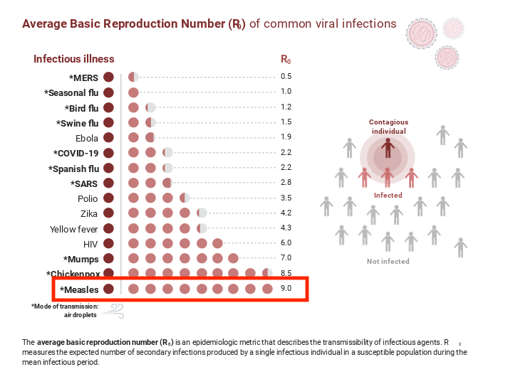

## Demo: Exponential Population Growth (week 2)

> **Learning goals**  
> • Simulate **deterministic exponential growth**.  
> • Explore how **initial size** \(N_0\) and **growth rate** \(r\) shape trajectories.  
> • Compute **doubling time** \(T_d = \ln 2 / r\) and **time to reach a threshold**.  

### Exponential population growth model

Exponential growth assumes the population changes proportionally to its current size:
\[
N_t \;=\; N_0 \, e^{r t},
\]
where \(N_0\) is the initial size and \(r\) is the **per‑time growth rate**.

- **Doubling time:** \(T_d = \dfrac{\ln 2}{r}\) (time until \(N_t\) doubles).  
- **Time to threshold \(N^\*\):** \(t^\* = \dfrac{\ln(N^\*/N_0)}{r}\).

---

### Simulate & plot a single scenario

```{r setup, message=FALSE, warning=FALSE}
set.seed(1)  # reproducibility for optional noise below
```

First we will write a function to compute the population size and time step t. 

```{r function}

calcN <- function(N0, r, t){
### N0 is the initial population size, r is the growth rate, and t is the time step
 N <- N0 * exp(r * t)
 return(N)
}
```

Set parameters (tweak live to show effects of **N0** and **r**):

```{r simulate}
N0 <- 50        # initial size
r  <- 0.08      # growth rate per time step
T  <- 50        # number of time steps
t <- 0:T

N <- calcN(N0=N0, r=r, t=t)

head(data.frame(t, N), 5)
```

Plot the trajectory:

```{r plot-deterministic, fig.height=3.6, fig.width=6}

plot(t, N, type = "l", main = "Deterministic exponential growth",
       xlab = "Time (t)", ylab = "N_t")

```

Compute **doubling time** directly from `r`:

```{r doubling}
Td <- log(2) / r
Td

calcDoublingTime <- function(r){
  double.t <- log(2)/r 
  return(double.t )
}

calcDoublingTime(1.0)
```

Compute **time to threshold** \(N^\* = 10{,}000\) (can change this number to explore different dynamics):

```{r threshold}
N_star <- 10000
t_star <- (log(N_star) - log(N0)) / r
t_star

calcTstar <- function(Nstar, N0, r){
  tstar <- (log(Nstar) - log(N0))/r
  return(tstar)
}

calcTstar(Nstar = 10^10, N0 = 1, r = 0.01)
```

---

### Compare two growth rates 

Side‑by‑side curves make the influence of \(r\) obvious.

```{r compare-two, fig.height=3.6, fig.width=6}
r1 <- 0.05
r2 <- 0.10
t  <- 0:T
N1 <- calcN(N0, r1, t)
N2 <- calcN(N0, r2, t)

matplot(t, cbind(N1, N2), type = "b", pch = 1:2, col = 1:2,
          xlab = "Time (t)", ylab = "N_t",
          main = "Exponential growth with two r values")

legend("topleft", legend = c(paste("r =", r1), paste("r =", r2)),
         pch = 1:2, col = 1:2, bty = "n")
```

**Observation.** Small changes in \(r\) cause large differences later in time.

---

### In class challenge

1) Change `r` to from a number < $-1$ to a number $>$ 1, trying 10 different numbers. HINT: use a for loop.  Describe what the different `r` do to the population dynamics. 

```{r}

calcN <- function(N0, r, t){
  # N0: initial population size, r: growth rate, t: time step
  N <- N0 * exp(r * t)
  return(N)
}

N0     <- 10          # initial population
Tmax   <- 20          # number of time steps
rvals  <- seq(-0.1, 1, length.out = 10) 

outN <- matrix(NA, nrow = Tmax, ncol = length(rvals))

for(i in 1:length(rvals)){
  this.r <- rvals[i]
  outN[, i] <- calcN(N0, this.r, 1:Tmax)
}

colnames(outN) <- round(rvals, 2)

matplot(1:Tmax, outN, type = "l", lty = 1, lwd = 2,
        col = viridis::viridis(length(rvals)),
        xlab = "Time step", ylab = "Population size (N)",
        main = "Population trajectories across r values")
legend("topleft", legend = round(rvals, 2),
       col = viridis::viridis(length(rvals)), lty = 1, cex = 0.8)
```


2) Another type of "population" can grow exponentially is the population of infected individuals. We have a separate model for their growth known as SIR models (susceptible-infected-recovered), but when a infectious disease is first introduced to a population, it grows exponentially because no one is immune (i.e., via getting sick and recovering or getting vaccinated) `r`.  Explore the population trajectory of measles if no one in Eugene were vaccinated, and one infected person was introduced (N0=1). How long would it take for the entire population of  178,786 to be sick? 

- R0 = basic reproduction number (average number of secondary infections per infected person),

- r = exponential growth rate (per time unit, e.g., per day),

- Tg = mean generation interval (average time between infections in a transmission chain).

r = Tg / ln(R0)

Tg  is generally assumed to be around 12. 


{width=60%}

```{r}
calcTstar <- function(Nstar, N0, r){
  tstar <- (log(Nstar) - log(N0))/r
  return(tstar)
}

calcN <- function(N0, r, t){
### N0 is the initial population size, r is the growth rate, and t is the time step
 N <- N0 * exp(r * t)
 return(N)
}

R0 <- 9
Tg <- 12  # mean generation interval (days)

r <- log(R0) / Tg
r

N0 <- 1
t <- 0:100   # days
N <- calcN(N0, r, t)

calcTstar(Nstar = 178786, N0 = 1, r = r)

## can also plot without the log = y, but it is easier to see the cutoff this way
plot(t, N, type = "l", log = "y", ylab = "Infected", xlab = "Days",
     main = "Early exponential growth of measles (no immunity)")
abline(h = 178786, col = "red", lty = 2)

## It will take about two months (~66 days)

```

