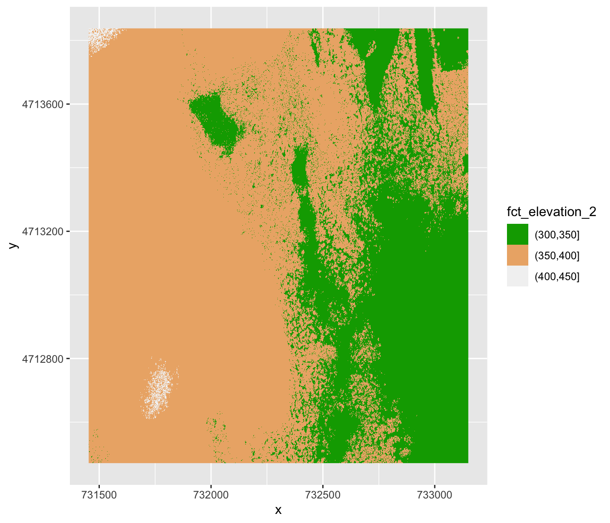
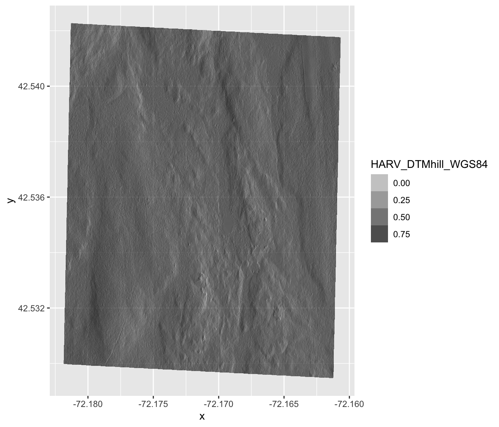
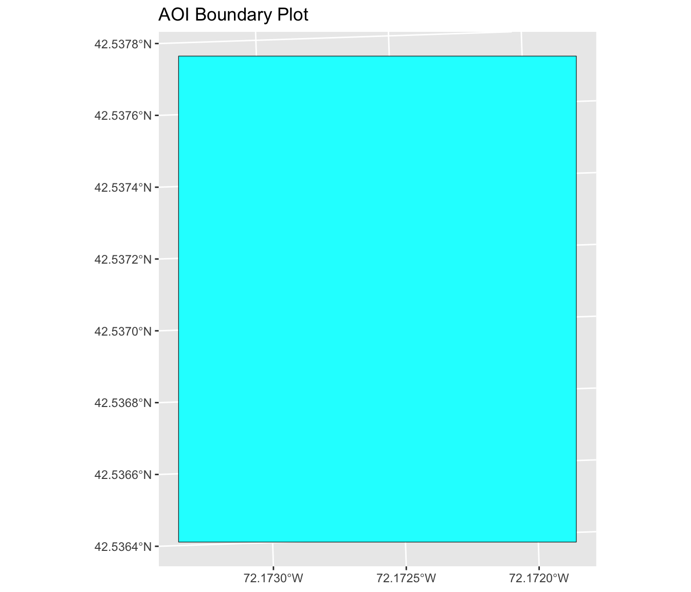
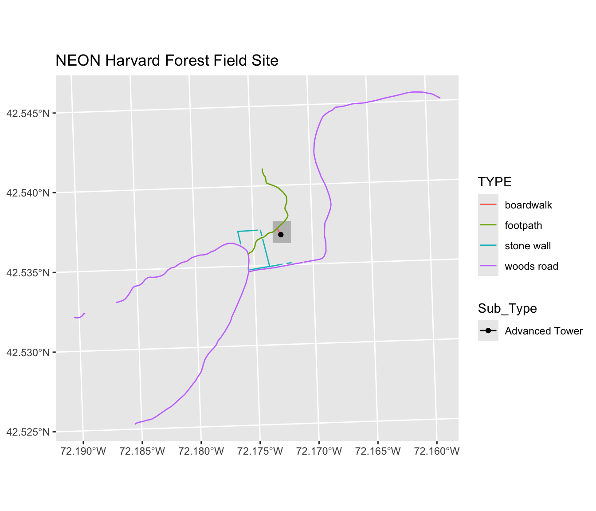
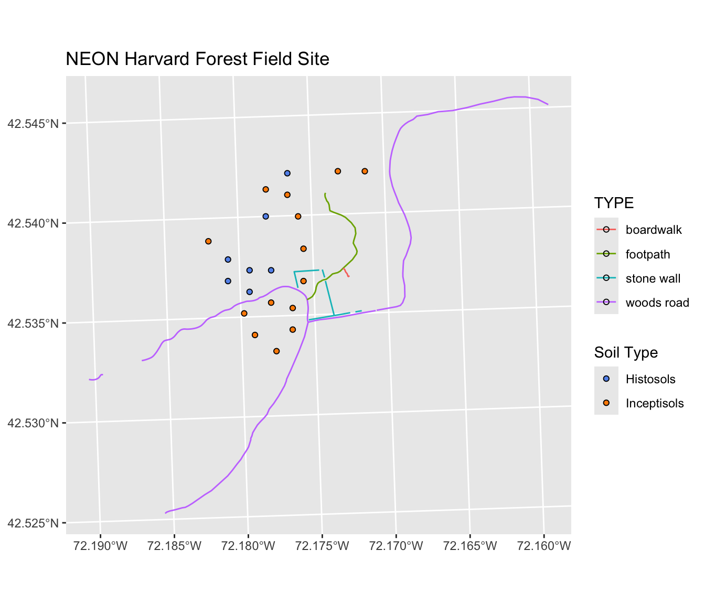

# Geospatial data I: data types (rasters and vector data)

##    Lecture summary 

We will explore the properties of raster (M) and vetcor (W) and their properties and plot them. The readings is about shifts in fire severity in Oregon (Haldofsky et al. 2020) and we will visualize that change in our lab by plotting the fire severities of several recent wildfires. 

###   Learning Objectives

For Monday, we will: 

- Describe the fundamental attributes of a raster dataset.
- Explore raster attributes and metadata using R.
- Import rasters into R using the `terra` package.
- Plot a raster file in R using the `ggplot2` package.
- Describe the difference between single- and multi-band rasters.
- Build customized plots for a single band raster using the `ggplot2` package.
- Layer a raster dataset on top of a hillshade to create an elegant basemap.
- Reproject a raster 

For Wednesday, we will: 

- Metadata for vector layers include geometry type, CRS, and extent.
- Load spatial objects into R with the `st_read()` function.
- Spatial objects can be plotted directly with `ggplot` using the `geom_sf()`
  function. No need to convert to a dataframe.

### Raster Data

Raster data is any pixelated (or gridded) data where each pixel is associated with a specific geographical location. The value of a pixel can be continuous (e.g. elevation) or categorical (e.g. land use). If this sounds familiar, it is because this data structure is very common: it's how we represent any digital image. A geospatial raster is only different from a digital photo in that it is accompanied by spatial information that connects the data to a particular location. This includes the raster's extent and cell size, the number of rows and columns, and its coordinate reference system (or CRS).

{alt='Raster Concept'}

**Continuous rasters**
Some examples of continuous rasters include:

1. Precipitation maps.
2. Maps of tree height derived from LiDAR data.
3. Elevation values for a region.

**Categorial rasters**
Some rasters contain categorical data where each pixel represents a discrete class such as a landcover type (e.g., "forest" or "grassland") rather than a continuous value such as elevation or temperature. Some examples of classified maps include:

1. Landcover / land-use maps.
2. Tree height maps classified as short, medium, and tall trees.
3. Elevation maps classified as low, medium, and high elevation.

{alt='USA landcover classification'}

**Reading in raster data and understanding its attributes** 

**The Data**
The data  was collected by [National Ecological Observatory Network (NEON)](https://www.neonscience.org/). 
The data uses data from Harvard Forest (harv) - Massachusetts, USA - [fieldsite description](https://www.neonscience.org/field-sites/harv)

**View Raster File Attributes**

We will be working with a series of GeoTIFF files. The
GeoTIFF format contains a set of embedded tags with metadata about the raster data. We can use the function `describe()` to get information about our raster data before we read that data into R. It is ideal to do this before importing your data.

We will be using the digital elevation model (DSM) data from the forest


``` r
describe("data/NEON-DS-Airborne-Remote-Sensing/HARV/DSM/HARV_dsmCrop.tif")
```

```
##  [1] "Driver: GTiff/GeoTIFF"                                                                                                                                                                                                                                                          
##  [2] "Files: data/NEON-DS-Airborne-Remote-Sensing/HARV/DSM/HARV_dsmCrop.tif"                                                                                                                                                                                                          
##  [3] "Size is 1697, 1367"                                                                                                                                                                                                                                                             
##  [4] "Coordinate System is:"                                                                                                                                                                                                                                                          
##  [5] "PROJCRS[\"WGS 84 / UTM zone 18N\","                                                                                                                                                                                                                                             
##  [6] "    BASEGEOGCRS[\"WGS 84\","                                                                                                                                                                                                                                                    
##  [7] "        DATUM[\"World Geodetic System 1984\","                                                                                                                                                                                                                                  
##  [8] "            ELLIPSOID[\"WGS 84\",6378137,298.257223563,"                                                                                                                                                                                                                        
##  [9] "                LENGTHUNIT[\"metre\",1]]],"                                                                                                                                                                                                                                     
## [10] "        PRIMEM[\"Greenwich\",0,"                                                                                                                                                                                                                                                
## [11] "            ANGLEUNIT[\"degree\",0.0174532925199433]],"                                                                                                                                                                                                                         
## [12] "        ID[\"EPSG\",4326]],"                                                                                                                                                                                                                                                    
## [13] "    CONVERSION[\"UTM zone 18N\","                                                                                                                                                                                                                                               
## [14] "        METHOD[\"Transverse Mercator\","                                                                                                                                                                                                                                        
## [15] "            ID[\"EPSG\",9807]],"                                                                                                                                                                                                                                                
## [16] "        PARAMETER[\"Latitude of natural origin\",0,"                                                                                                                                                                                                                            
## [17] "            ANGLEUNIT[\"degree\",0.0174532925199433],"                                                                                                                                                                                                                          
## [18] "            ID[\"EPSG\",8801]],"                                                                                                                                                                                                                                                
## [19] "        PARAMETER[\"Longitude of natural origin\",-75,"                                                                                                                                                                                                                         
## [20] "            ANGLEUNIT[\"degree\",0.0174532925199433],"                                                                                                                                                                                                                          
## [21] "            ID[\"EPSG\",8802]],"                                                                                                                                                                                                                                                
## [22] "        PARAMETER[\"Scale factor at natural origin\",0.9996,"                                                                                                                                                                                                                   
## [23] "            SCALEUNIT[\"unity\",1],"                                                                                                                                                                                                                                            
## [24] "            ID[\"EPSG\",8805]],"                                                                                                                                                                                                                                                
## [25] "        PARAMETER[\"False easting\",500000,"                                                                                                                                                                                                                                    
## [26] "            LENGTHUNIT[\"metre\",1],"                                                                                                                                                                                                                                           
## [27] "            ID[\"EPSG\",8806]],"                                                                                                                                                                                                                                                
## [28] "        PARAMETER[\"False northing\",0,"                                                                                                                                                                                                                                        
## [29] "            LENGTHUNIT[\"metre\",1],"                                                                                                                                                                                                                                           
## [30] "            ID[\"EPSG\",8807]]],"                                                                                                                                                                                                                                               
## [31] "    CS[Cartesian,2],"                                                                                                                                                                                                                                                           
## [32] "        AXIS[\"(E)\",east,"                                                                                                                                                                                                                                                     
## [33] "            ORDER[1],"                                                                                                                                                                                                                                                          
## [34] "            LENGTHUNIT[\"metre\",1]],"                                                                                                                                                                                                                                          
## [35] "        AXIS[\"(N)\",north,"                                                                                                                                                                                                                                                    
## [36] "            ORDER[2],"                                                                                                                                                                                                                                                          
## [37] "            LENGTHUNIT[\"metre\",1]],"                                                                                                                                                                                                                                          
## [38] "    USAGE["                                                                                                                                                                                                                                                                     
## [39] "        SCOPE[\"Navigation and medium accuracy spatial referencing.\"],"                                                                                                                                                                                                        
## [40] "        AREA[\"Between 78°W and 72°W, northern hemisphere between equator and 84°N, onshore and offshore. Bahamas. Canada - Nunavut; Ontario; Quebec. Colombia. Cuba. Ecuador. Greenland. Haiti. Jamaica. Panama. Turks and Caicos Islands. United States (USA). Venezuela.\"],"
## [41] "        BBOX[0,-78,84,-72]],"                                                                                                                                                                                                                                                   
## [42] "    ID[\"EPSG\",32618]]"                                                                                                                                                                                                                                                        
## [43] "Data axis to CRS axis mapping: 1,2"                                                                                                                                                                                                                                             
## [44] "Origin = (731453.000000000000000,4713838.000000000000000)"                                                                                                                                                                                                                      
## [45] "Pixel Size = (1.000000000000000,-1.000000000000000)"                                                                                                                                                                                                                            
## [46] "Metadata:"                                                                                                                                                                                                                                                                      
## [47] "  AREA_OR_POINT=Area"                                                                                                                                                                                                                                                           
## [48] "Image Structure Metadata:"                                                                                                                                                                                                                                                      
## [49] "  COMPRESSION=LZW"                                                                                                                                                                                                                                                              
## [50] "  INTERLEAVE=BAND"                                                                                                                                                                                                                                                              
## [51] "Corner Coordinates:"                                                                                                                                                                                                                                                            
## [52] "Upper Left  (  731453.000, 4713838.000) ( 72d10'52.71\"W, 42d32'32.18\"N)"                                                                                                                                                                                                      
## [53] "Lower Left  (  731453.000, 4712471.000) ( 72d10'54.71\"W, 42d31'47.92\"N)"                                                                                                                                                                                                      
## [54] "Upper Right (  733150.000, 4713838.000) ( 72d 9'38.40\"W, 42d32'30.35\"N)"                                                                                                                                                                                                      
## [55] "Lower Right (  733150.000, 4712471.000) ( 72d 9'40.41\"W, 42d31'46.08\"N)"                                                                                                                                                                                                      
## [56] "Center      (  732301.500, 4713154.500) ( 72d10'16.56\"W, 42d32' 9.13\"N)"                                                                                                                                                                                                      
## [57] "Band 1 Block=1697x1 Type=Float64, ColorInterp=Gray"                                                                                                                                                                                                                             
## [58] "  Min=305.070 Max=416.070 "                                                                                                                                                                                                                                                     
## [59] "  Minimum=305.070, Maximum=416.070, Mean=359.853, StdDev=17.832"                                                                                                                                                                                                                
## [60] "  NoData Value=-9999"                                                                                                                                                                                                                                                           
## [61] "  Metadata:"                                                                                                                                                                                                                                                                    
## [62] "    STATISTICS_MAXIMUM=416.06997680664"                                                                                                                                                                                                                                         
## [63] "    STATISTICS_MEAN=359.85311802914"                                                                                                                                                                                                                                            
## [64] "    STATISTICS_MINIMUM=305.07000732422"                                                                                                                                                                                                                                         
## [65] "    STATISTICS_STDDEV=17.83169335933"
```

If you wish to store this information in R, you can do the following:


``` r
HARV_dsmCrop_info <- capture.output(
  describe("data/NEON-DS-Airborne-Remote-Sensing/HARV/DSM/HARV_dsmCrop.tif")
)
HARV_dsmCrop_info
```

```
##  [1] " [1] \"Driver: GTiff/GeoTIFF\"                                                                                                                                                                                                                                                          "    
##  [2] " [2] \"Files: data/NEON-DS-Airborne-Remote-Sensing/HARV/DSM/HARV_dsmCrop.tif\"                                                                                                                                                                                                          "    
##  [3] " [3] \"Size is 1697, 1367\"                                                                                                                                                                                                                                                             "    
##  [4] " [4] \"Coordinate System is:\"                                                                                                                                                                                                                                                          "    
##  [5] " [5] \"PROJCRS[\\\"WGS 84 / UTM zone 18N\\\",\"                                                                                                                                                                                                                                             "
##  [6] " [6] \"    BASEGEOGCRS[\\\"WGS 84\\\",\"                                                                                                                                                                                                                                                    "
##  [7] " [7] \"        DATUM[\\\"World Geodetic System 1984\\\",\"                                                                                                                                                                                                                                  "
##  [8] " [8] \"            ELLIPSOID[\\\"WGS 84\\\",6378137,298.257223563,\"                                                                                                                                                                                                                        "
##  [9] " [9] \"                LENGTHUNIT[\\\"metre\\\",1]]],\"                                                                                                                                                                                                                                     "
## [10] "[10] \"        PRIMEM[\\\"Greenwich\\\",0,\"                                                                                                                                                                                                                                                "
## [11] "[11] \"            ANGLEUNIT[\\\"degree\\\",0.0174532925199433]],\"                                                                                                                                                                                                                         "
## [12] "[12] \"        ID[\\\"EPSG\\\",4326]],\"                                                                                                                                                                                                                                                    "
## [13] "[13] \"    CONVERSION[\\\"UTM zone 18N\\\",\"                                                                                                                                                                                                                                               "
## [14] "[14] \"        METHOD[\\\"Transverse Mercator\\\",\"                                                                                                                                                                                                                                        "
## [15] "[15] \"            ID[\\\"EPSG\\\",9807]],\"                                                                                                                                                                                                                                                "
## [16] "[16] \"        PARAMETER[\\\"Latitude of natural origin\\\",0,\"                                                                                                                                                                                                                            "
## [17] "[17] \"            ANGLEUNIT[\\\"degree\\\",0.0174532925199433],\"                                                                                                                                                                                                                          "
## [18] "[18] \"            ID[\\\"EPSG\\\",8801]],\"                                                                                                                                                                                                                                                "
## [19] "[19] \"        PARAMETER[\\\"Longitude of natural origin\\\",-75,\"                                                                                                                                                                                                                         "
## [20] "[20] \"            ANGLEUNIT[\\\"degree\\\",0.0174532925199433],\"                                                                                                                                                                                                                          "
## [21] "[21] \"            ID[\\\"EPSG\\\",8802]],\"                                                                                                                                                                                                                                                "
## [22] "[22] \"        PARAMETER[\\\"Scale factor at natural origin\\\",0.9996,\"                                                                                                                                                                                                                   "
## [23] "[23] \"            SCALEUNIT[\\\"unity\\\",1],\"                                                                                                                                                                                                                                            "
## [24] "[24] \"            ID[\\\"EPSG\\\",8805]],\"                                                                                                                                                                                                                                                "
## [25] "[25] \"        PARAMETER[\\\"False easting\\\",500000,\"                                                                                                                                                                                                                                    "
## [26] "[26] \"            LENGTHUNIT[\\\"metre\\\",1],\"                                                                                                                                                                                                                                           "
## [27] "[27] \"            ID[\\\"EPSG\\\",8806]],\"                                                                                                                                                                                                                                                "
## [28] "[28] \"        PARAMETER[\\\"False northing\\\",0,\"                                                                                                                                                                                                                                        "
## [29] "[29] \"            LENGTHUNIT[\\\"metre\\\",1],\"                                                                                                                                                                                                                                           "
## [30] "[30] \"            ID[\\\"EPSG\\\",8807]]],\"                                                                                                                                                                                                                                               "
## [31] "[31] \"    CS[Cartesian,2],\"                                                                                                                                                                                                                                                           "    
## [32] "[32] \"        AXIS[\\\"(E)\\\",east,\"                                                                                                                                                                                                                                                     "
## [33] "[33] \"            ORDER[1],\"                                                                                                                                                                                                                                                          "    
## [34] "[34] \"            LENGTHUNIT[\\\"metre\\\",1]],\"                                                                                                                                                                                                                                          "
## [35] "[35] \"        AXIS[\\\"(N)\\\",north,\"                                                                                                                                                                                                                                                    "
## [36] "[36] \"            ORDER[2],\"                                                                                                                                                                                                                                                          "    
## [37] "[37] \"            LENGTHUNIT[\\\"metre\\\",1]],\"                                                                                                                                                                                                                                          "
## [38] "[38] \"    USAGE[\"                                                                                                                                                                                                                                                                     "    
## [39] "[39] \"        SCOPE[\\\"Navigation and medium accuracy spatial referencing.\\\"],\"                                                                                                                                                                                                        "
## [40] "[40] \"        AREA[\\\"Between 78°W and 72°W, northern hemisphere between equator and 84°N, onshore and offshore. Bahamas. Canada - Nunavut; Ontario; Quebec. Colombia. Cuba. Ecuador. Greenland. Haiti. Jamaica. Panama. Turks and Caicos Islands. United States (USA). Venezuela.\\\"],\""
## [41] "[41] \"        BBOX[0,-78,84,-72]],\"                                                                                                                                                                                                                                                   "    
## [42] "[42] \"    ID[\\\"EPSG\\\",32618]]\"                                                                                                                                                                                                                                                        "
## [43] "[43] \"Data axis to CRS axis mapping: 1,2\"                                                                                                                                                                                                                                             "    
## [44] "[44] \"Origin = (731453.000000000000000,4713838.000000000000000)\"                                                                                                                                                                                                                      "    
## [45] "[45] \"Pixel Size = (1.000000000000000,-1.000000000000000)\"                                                                                                                                                                                                                            "    
## [46] "[46] \"Metadata:\"                                                                                                                                                                                                                                                                      "    
## [47] "[47] \"  AREA_OR_POINT=Area\"                                                                                                                                                                                                                                                           "    
## [48] "[48] \"Image Structure Metadata:\"                                                                                                                                                                                                                                                      "    
## [49] "[49] \"  COMPRESSION=LZW\"                                                                                                                                                                                                                                                              "    
## [50] "[50] \"  INTERLEAVE=BAND\"                                                                                                                                                                                                                                                              "    
## [51] "[51] \"Corner Coordinates:\"                                                                                                                                                                                                                                                            "    
## [52] "[52] \"Upper Left  (  731453.000, 4713838.000) ( 72d10'52.71\\\"W, 42d32'32.18\\\"N)\"                                                                                                                                                                                                      "
## [53] "[53] \"Lower Left  (  731453.000, 4712471.000) ( 72d10'54.71\\\"W, 42d31'47.92\\\"N)\"                                                                                                                                                                                                      "
## [54] "[54] \"Upper Right (  733150.000, 4713838.000) ( 72d 9'38.40\\\"W, 42d32'30.35\\\"N)\"                                                                                                                                                                                                      "
## [55] "[55] \"Lower Right (  733150.000, 4712471.000) ( 72d 9'40.41\\\"W, 42d31'46.08\\\"N)\"                                                                                                                                                                                                      "
## [56] "[56] \"Center      (  732301.500, 4713154.500) ( 72d10'16.56\\\"W, 42d32' 9.13\\\"N)\"                                                                                                                                                                                                      "
## [57] "[57] \"Band 1 Block=1697x1 Type=Float64, ColorInterp=Gray\"                                                                                                                                                                                                                             "    
## [58] "[58] \"  Min=305.070 Max=416.070 \"                                                                                                                                                                                                                                                     "    
## [59] "[59] \"  Minimum=305.070, Maximum=416.070, Mean=359.853, StdDev=17.832\"                                                                                                                                                                                                                "    
## [60] "[60] \"  NoData Value=-9999\"                                                                                                                                                                                                                                                           "    
## [61] "[61] \"  Metadata:\"                                                                                                                                                                                                                                                                    "    
## [62] "[62] \"    STATISTICS_MAXIMUM=416.06997680664\"                                                                                                                                                                                                                                         "    
## [63] "[63] \"    STATISTICS_MEAN=359.85311802914\"                                                                                                                                                                                                                                            "    
## [64] "[64] \"    STATISTICS_MINIMUM=305.07000732422\"                                                                                                                                                                                                                                         "    
## [65] "[65] \"    STATISTICS_STDDEV=17.83169335933\"                                                                                                                                                                                                                                           "
```

Each line of text that was printed to the console is now stored as an element of
the character vector `HARV_dsmCrop_info`. We will be exploring this data throughout this
demo. By the end of this demo, you will be able to explain and understand the output above.

**BP programming tip - Object names**

To improve code readability, file and object names should be used that make it clear what is in the file. The data for this demo were collected from Harvard Forest so we'll use a naming convention of `datatype_harv`.

**Open a Raster in R**
Now that we've previewed the metadata for our GeoTIFF, let's import this
raster dataset into R and explore its metadata more closely. We can use the `rast()` function to open a raster in R.


``` r
DSM_harv <-
  rast("data/NEON-DS-Airborne-Remote-Sensing/HARV/DSM/HARV_dsmCrop.tif")

DSM_harv
```

```
## class       : SpatRaster 
## size        : 1367, 1697, 1  (nrow, ncol, nlyr)
## resolution  : 1, 1  (x, y)
## extent      : 731453, 733150, 4712471, 4713838  (xmin, xmax, ymin, ymax)
## coord. ref. : WGS 84 / UTM zone 18N (EPSG:32618) 
## source      : HARV_dsmCrop.tif 
## name        : HARV_dsmCrop 
## min value   :       305.07 
## max value   :       416.07
```

The information above includes a report of min and max values, but no other data range statistics. Similar to other R data structures like vectors and data frame columns, descriptive statistics for raster data can be retrieved like


``` r
summary(DSM_harv)
```

```
## Warning: [summary] used a sample
```

```
##   HARV_dsmCrop  
##  Min.   :305.6  
##  1st Qu.:345.6  
##  Median :359.6  
##  Mean   :359.8  
##  3rd Qu.:374.3  
##  Max.   :414.7
```

but note the warning - unless you force R to calculate these statistics using every cell in the raster, it will take a random sample of 100,000 cells and calculate from that instead. To force calculation all the values, you can use the function `values`:


``` r
summary(values(DSM_harv))
```

```
##   HARV_dsmCrop  
##  Min.   :305.1  
##  1st Qu.:345.6  
##  Median :359.7  
##  Mean   :359.9  
##  3rd Qu.:374.3  
##  Max.   :416.1
```

To visualise this data in R using `ggplot2`, we need to convert it to a
dataframe.  The `terra` package has an built-in function for conversion to a plot-able dataframe. We need to tell R that the data is geo-referenced using the argument xy=TRUE.


``` r
DSM_harv_df <- as.data.frame(DSM_harv, xy = TRUE)
```

Now when we view the structure of our data, we will see a standard
dataframe format.


``` r
str(DSM_harv_df)
```

```
## 'data.frame':	2319799 obs. of  3 variables:
##  $ x           : num  731454 731454 731456 731456 731458 ...
##  $ y           : num  4713838 4713838 4713838 4713838 4713838 ...
##  $ HARV_dsmCrop: num  409 408 407 407 409 ...
```

We can use `ggplot()` to plot this data. 
- We will set the color scale to  `scale_fill_viridis_c` which is a color-blindness friendly color scale. 


``` r
ggplot() +
    geom_raster(data = DSM_harv_df , aes(x = x, y = y, fill = HARV_dsmCrop)) +
    scale_fill_viridis_c() 
```

<div class="figure">

<p class="caption">(\#fig:unnamed-chunk-7)Raster plot with ggplot2 using the viridis color scale</p>
</div>

**Plotting Tip**

More information about the Viridis palette used above at
[R Viridis package documentation](https://cran.r-project.org/web/packages/viridis/vignettes/intro-to-viridis.html).

**What do we see?** 
This map shows the digital surface model, so the elevation of the surface of our study site in Harvard Forest. From the legend, we can see that the maximum elevation is ~400, but we can't tell whether this is 400 feet or 400 meters because the legend doesn't show us the units. We
can look at the metadata of our object to see what the units are. Much of the metadata that we're interested in is part of the Coordinate Reference System (CRS). 

Now we will see how features of the CRS appear in our data file and what
meanings they have.

**Raster Coordinate Reference System (CRS)** 

We can view the CRS string associated with our R object using the`crs()`
function.


``` r
crs(DSM_harv, proj = TRUE)
```

```
## [1] "+proj=utm +zone=18 +datum=WGS84 +units=m +no_defs"
```


What units are our data in?
`+units=m` tells us that our data is in meters.

**Understanding CRS in Proj4 Format**

The CRS for our data is given to us by R in `proj4` format. Let's break down the pieces of `proj4` string. The string contains all of the individual CRS elements that R or another GIS might need. Each element is specified with a `+` sign, similar to how a `.csv` file is delimited or broken up by a `,`. After each `+` we see the CRS element being defined. For example projection (`proj=`) and datum (`datum=`).

**UTM Proj4 String**

A projection string (like the one of `DSM_harv`) specifies the UTM projection  as follows:

`+proj=utm +zone=18 +datum=WGS84 +units=m +no_defs'

- **proj=utm:** the projection is UTM, UTM has several zones.
- **zone=18:** the zone is 18
- **datum=WGS84:** the datum is WGS84 (the datum refers to the  0,0 reference for
  the coordinate system used in the projection)
- **units=m:** the units for the coordinates are in meters

Sometimes you will also see
+ellps=WGS84 +towgs84=0,0,0`

- **ellps=WGS84:** the ellipsoid (how the earth's  roundness is calculated) for
  the data is WGS84 (not in our crs above, but it can be.)
- **+towgs84=0,0,0**  parameter shifts (translation + rotation + scaling) realted to the datum

Note that the zone is unique to the UTM projection. Not all CRSs will have a zone. Image source: Chrismurf at English Wikipedia, via [Wikimedia Commons](https://en.wikipedia.org/wiki/Universal_Transverse_Mercator_coordinate_system#/media/File:Utm-zones-USA.svg) (CC-BY).


{alt='UTM zones in the USA.'}

**Extent**

The spatial extent is the geographic area that the raster data covers.
The spatial extent of an R spatial object represents the geographic edge or
location that is the furthest north, south, east and west. In other words, extent
represents the overall geographic coverage of the spatial object.

{alt='Spatial extent image'}

(Image Source: National Ecological Observatory Network (NEON))
{: .text-center}


``` r
ext(DSM_harv)
```

```
## SpatExtent : 731453, 733150, 4712471, 4713838 (xmin, xmax, ymin, ymax)
```

**Resolution**

A resolution of a raster represents the area on the ground that each
pixel of the raster covers. The image below illustrates the effect
of changes in resolution.

{alt='Resolution image'}

(Source: National Ecological Observatory Network (NEON))
{: .text-center}


``` r
res(DSM_harv)
```

```
## [1] 1 1
```

**Raster Bands**

The Digital Surface Model object (`DSM_harv`) that we've been working with is a single band raster. This means that there is only one dataset stored in the raster: surface elevation in meters for one time period.

{alt='Multi-band raster image'}

A raster dataset can contain one or more bands. We can use the `rast()`
function to import one single band from a single or multi-band raster. We can view the number of bands in a raster using the `nly()` function.


``` r
nlyr(DSM_harv)
```

```
## [1] 1
```

However, raster data can also be multi-band, meaning that one raster file
contains data for more than one variable or time period for each cell. By
default the `raster()` function only imports the first band in a raster
regardless of whether it has one or more bands. 

**Calculate Raster Min and Max Values**

It is useful to know the minimum or maximum values of a raster dataset. In this case, given we are working with elevation data, these values represent the min/max elevation range at our site.

Raster statistics are often calculated and embedded in a GeoTIFF for us. We can view these values:

We can see that the elevation at our site ranges from 305.0700073m to
416.0699768m.


``` r
minmax(DSM_harv)
```

```
##     HARV_dsmCrop
## min       305.07
## max       416.07
```

``` r
min(values(DSM_harv))
```

```
## [1] 305.07
```

``` r
max(values(DSM_harv))
```

```
## [1] 416.07
```
**"Classifying" a raster**

**Binning Raster Data and Plotting Binned data**

Above, we viewed our data using a continuous color ramp. For
clarity and visibility of the plot, we may prefer to view the data in discrete bins or colored according to ranges of values. This is comparable to a "classified" map. To do this, we need to tell `ggplot` how many groups to break our data  into, and where those breaks should be. To make these decisions, it is useful  to first explore the distribution of the data using a bar plot. To begin with,  we will use `dplyr`'s `mutate()` function combined with `cut()` to split the  data into 3 bins.

We want to set cutoff values for these groups to have the elevation ranges of 301–350 m, 351–400 m, and 401–450 m. To implement this we will give `mutate()` a numeric vector of break points instead of the number of breaks we want.


``` r
custom_bins <- c(300, 350, 400, 450)

DSM_harv_df <- DSM_harv_df %>%
  mutate(fct_elevation_2 = cut(HARV_dsmCrop, breaks = custom_bins))

unique(DSM_harv_df$fct_elevation_2)
```

```
## [1] (400,450] (350,400] (300,350]
## Levels: (300,350] (350,400] (400,450]
```

We can use those groups to plot our raster data, with each group being a 
different color:


``` r
ggplot() +
  geom_raster(data = DSM_harv_df , aes(x = x, y = y, fill = fct_elevation_2)) 
```


The plot above uses the default colors inside `ggplot` for raster objects.
We can specify our own colors to make the plot look a little nicer.
R has a built in set of colors for plotting terrain, which are built in
to the `terrain.colors()` function.
Since we have three bins, we want to create a 3-color palette:


``` r
terrain.colors(3)
```

```
## [1] "#00A600" "#ECB176" "#F2F2F2"
```

The `terrain.colors()` function returns *hex colors* -
each of these character strings represents a color.
To use these in our map, we pass them across using the
`scale_fill_manual()` function.


``` r
ggplot() +
 geom_raster(data = DSM_harv_df , aes(x = x, y = y,
                                      fill = fct_elevation_2)) + 
    scale_fill_manual(values = terrain.colors(3)) 
```



**Layering Rasters**

We can layer a raster on top of a hillshade raster for the same area, and use a transparency factor to create a 3-dimensional shaded effect. 

The **hillshade layer** maps the terrain using light and shadow to create a  3D-looking image, based on a **hypothetical illumination of the ground level**.A hillshade is a raster that maps the shadows and texture that you would see from above when viewing terrain. We will add a custom color, making the plot grey.

First we need to read in our DSM hillshade data and view the structure:


``` r
DSM_hill_harv <-
  rast("data/NEON-DS-Airborne-Remote-Sensing/HARV/DSM/harv_DSMhill.tif")

DSM_hill_harv
```

```
## class       : SpatRaster 
## size        : 1367, 1697, 1  (nrow, ncol, nlyr)
## resolution  : 1, 1  (x, y)
## extent      : 731453, 733150, 4712471, 4713838  (xmin, xmax, ymin, ymax)
## coord. ref. : WGS 84 / UTM zone 18N (EPSG:32618) 
## source      : HARV_DSMhill.tif 
## name        : HARV_DSMhill 
## min value   :   -0.7136298 
## max value   :    0.9999997
```

Next we convert it to a dataframe, so that we can plot it using `ggplot2`:


``` r
DSM_hill_harv_df <- as.data.frame(DSM_hill_harv, xy = TRUE) 

str(DSM_hill_harv_df)
```

```
## 'data.frame':	2313675 obs. of  3 variables:
##  $ x           : num  731454 731456 731456 731458 731458 ...
##  $ y           : num  4713836 4713836 4713836 4713836 4713836 ...
##  $ HARV_DSMhill: num  -0.15567 0.00743 0.86989 0.9791 0.96283 ...
```

Now we can plot the hillshade data:


``` r
ggplot() +
  geom_raster(data = DSM_hill_harv_df,
              aes(x = x, y = y, alpha = HARV_DSMhill)) + 
  scale_alpha(range =  c(0.15, 0.65), guide = "none") 
```


We can layer another raster on top of our hillshade by adding another call to
the `geom_raster()` function. Let's overlay `DSM_harv` on top of the `hill_harv`.


``` r
ggplot() +
  geom_raster(data = DSM_harv_df , 
              aes(x = x, y = y, 
                  fill = HARV_dsmCrop)) + 
  geom_raster(data = DSM_hill_harv_df, 
              aes(x = x, y = y, 
                  alpha = HARV_DSMhill)) +  
  scale_fill_viridis_c() +  
  scale_alpha(range = c(0.15, 0.65), guide = "none") +  
  ggtitle("Elevation with hillshade") 
```


**Reprojection**

Sometimes we encounter raster datasets that do not "line up" when plotted or analyzed. Rasters that don't line up are most often in different Coordinate Reference Systems (CRS).  We will work through how to deal with rasters in  different, known CRSs. It will walk though reprojecting rasters in R using 
the `project()` function in the `terra` package.

**Raster Projection in R**

We will read in the Harvard Forest Digital Terrain
Model data. This differs from the surface model data we've been working with so far in that the digital surface model (DSM) includes the tops of trees, while the digital terrain model (DTM) shows the ground level.

Here, we will create a map of the Harvard ForestDigital Terrain Model (`DTM_harv`)  layered on top of the hillshade 
(`DTM_hill_harv`).

First, we need to import the DTM and DTM hillshade data.


``` r
DTM_harv <- 
    rast("data/NEON-DS-Airborne-Remote-Sensing/HARV/DTM/HARV_dtmCrop.tif")

DTM_hill_harv <- 
    rast("data/NEON-DS-Airborne-Remote-Sensing/HARV/DTM/HARV_DTMhill_WGS84.tif")
```

Next, we will convert each of these datasets to a dataframe for
plotting with `ggplot`.


``` r
DTM_harv_df <- as.data.frame(DTM_harv, xy = TRUE)

DTM_hill_harv_df <- as.data.frame(DTM_hill_harv, xy = TRUE)
```

Now we can create a map of the DTM layered over the hillshade.


``` r
ggplot() +
     geom_raster(data = DTM_harv_df , 
                 aes(x = x, y = y, 
                  fill = HARV_dtmCrop)) + 
     geom_raster(data = DTM_hill_harv_df, 
                 aes(x = x, y = y, 
                   alpha = HARV_DTMhill_WGS84)) +
     scale_fill_gradientn(name = "Elevation", colors = terrain.colors(10)) 
```


Our results are curious - neither the Digital Terrain Model (`DTM_harv_df`)
nor the DTM Hillshade (`DTM_hill_harv_df`) plotted.
Let's try to plot the DTM on its own to make sure there are data there.


``` r
ggplot() +
geom_raster(data = DTM_harv_df,
    aes(x = x, y = y,
    fill = HARV_dtmCrop)) +
scale_fill_gradientn(name = "Elevation", colors = terrain.colors(10))
```


Our DTM seems to contain data and plots just fine.

Next we plot the DTM Hillshade on its own to see whether everything is OK.


``` r
ggplot() +
geom_raster(data = DTM_hill_harv_df,
    aes(x = x, y = y,
    alpha = HARV_DTMhill_WGS84))
```



If we look at the axes, we can see that the projections of the two rasters are  different. When this is the case, `ggplot` won't render the image. It won't even throw an  error message to tell you something has gone wrong. We can look at Coordinate  Reference Systems (CRSs) of the DTM and the hillshade data to see how they 
differ.


``` r
# view crs for DTM
crs(DTM_harv, proj = TRUE)
```

```
## [1] "+proj=utm +zone=18 +datum=WGS84 +units=m +no_defs"
```

``` r
# view crs for hillshade
crs(DTM_hill_harv, proj = TRUE)
```

```
## [1] "+proj=longlat +datum=WGS84 +no_defs"
```

`DTM_harv` is in the UTM projection, with units of meters.
`DTM_hill_harv` is in `Geographic WGS84` - which is represented by latitude and longitude values.

Because the two rasters are in different CRSs, they don't line up when plotted in R. We need to reproject (or change the projection of) `DTM_hill_harv` into the UTM CRS. Alternatively, we could reproject `DTM_harv` into WGS84.

**Reproject Rasters**

We can use the `project()` function to reproject a raster into a new CRS.
Keep in mind that reprojection only works when you first have a defined CRS for the raster object that you want to reproject. It cannot be used if no CRS is defined. Lucky for us, the `DTM_hill_harv` has a defined CRS.

When we reproject a raster, we move it from one "grid" to another. Thus, we are  modifying the data! Keep this in mind as we work with raster data.

To use the `project()` function, we need to define two things:

1. the object we want to reproject and
2. the CRS that we want to reproject it to.

The syntax is `project(RasterObject, crs)`

We want the CRS of our hillshade to match the `DTM_harv` raster. We can thus assign the CRS of our `DTM_harv` to our hillshade within the `project()` function as follows: `crs(DTM_harv)`.
Note that we are using the `project()` function on the raster object,
not the `data.frame()` we use for plotting with `ggplot`.

First we will reproject our `DTM_hill_harv` raster data to match the `DTM_harv`  raster CRS:


``` r
DTM_hill_UTMZ18N_harv <- project(DTM_hill_harv,
                                 crs(DTM_harv))
```

Now we can compare the CRS of our original DTM hillshade and our new DTM 
hillshade, to see how they are different.


``` r
crs(DTM_hill_UTMZ18N_harv, proj = TRUE)
```

```
## [1] "+proj=utm +zone=18 +datum=WGS84 +units=m +no_defs"
```

``` r
crs(DTM_harv, proj = TRUE)
```

```
## [1] "+proj=utm +zone=18 +datum=WGS84 +units=m +no_defs"
```

We can also compare the extent of the two objects.


``` r
ext(DTM_hill_UTMZ18N_harv)
```

```
## SpatExtent : 731402.31567604, 733200.221994349, 4712407.19751409, 4713901.78222079 (xmin, xmax, ymin, ymax)
```

``` r
ext(DTM_hill_harv)
```

```
## SpatExtent : -72.1819236223343, -72.1606102223342, 42.5294079700285, 42.5423355900285 (xmin, xmax, ymin, ymax)
```

Notice in the output above that the `crs()` of `DTM_hill_UTMZ18N_harv` is now UTM. However, the extent values of `DTM_hillUTMZ18N_harv` are different from `DTM_hill_harv`.


### In class challange 1: Extent Change with CRS Change

Why do you think the two extents differ?

**Answers**

The extent for DTM\_hill\_UTMZ18N\_harv is in UTMs so the extent is in meters.  The extent for DTM\_hill\_harv is in lat/long so the extent is expressed in  decimal degrees.

**Deal with Raster Resolution**

Let's next have a look at the resolution of our reprojected hillshade versus our original data.


``` r
res(DTM_hill_UTMZ18N_harv)
```

```
## [1] 1.001061 1.001061
```

``` r
res(DTM_harv)
```

```
## [1] 1 1
```

These two resolutions are different, but they're representing the same data. We  can tell R to force our newly reprojected raster to be 1m x 1m resolution by  adding a line of code `res=1` within the `project()` function. In the  example below, we ensure a resolution match by using `res(DTM_harv)` as a variable.


``` r
  DTM_hill_UTMZ18N_harv <- project(DTM_hill_harv, 
                                   crs(DTM_harv), 
                                   res = res(DTM_harv)) 
```

Now both our resolutions and our CRSs match, so we can plot these two data sets together. Let's double-check our resolution to be sure:


``` r
res(DTM_hill_UTMZ18N_harv)
```

```
## [1] 1 1
```

``` r
res(DTM_harv)
```

```
## [1] 1 1
```

For plotting with `ggplot()`, we will need to create a dataframe from our newly reprojected raster.


``` r
DTM_hill_harv_2_df <- as.data.frame(DTM_hill_UTMZ18N_harv, xy = TRUE)
```

We can now create a plot of this data.


``` r
ggplot() +
     geom_raster(data = DTM_harv_df , 
                 aes(x = x, y = y, 
                  fill = HARV_dtmCrop)) + 
     geom_raster(data = DTM_hill_harv_2_df, 
                 aes(x = x, y = y, 
                   alpha = HARV_DTMhill_WGS84)) +
     scale_fill_gradientn(name = "Elevation", colors = terrain.colors(10))
```


We have now successfully draped the Digital Terrain Model on top of our
hillshade to produce a nice looking, textured map!

### In class challenge 2: Reproject, then Plot a Digital Terrain Model

Create a map of the
[San Joaquin Experimental Range](https://www.neonscience.org/field-sites/field-sites-map/SJER)
field site using the `SJER_DSMhill_WGS84.tif` and `SJER_dsmCrop.tif` files.

Reproject the data as necessary to make things line up!


**Answers**


``` r
# import DSM
DSM_SJER <- 
    rast("data/NEON-DS-Airborne-Remote-Sensing/SJER/DSM/SJER_dsmCrop.tif")
# import DSM hillshade
DSM_hill_SJER_WGS <-
    rast("data/NEON-DS-Airborne-Remote-Sensing/SJER/DSM/SJER_DSMhill_WGS84.tif")

# reproject raster
DSM_hill_UTMZ18N_SJER <- project(DSM_hill_SJER_WGS,
                                 crs(DSM_SJER),
                                 res = 1)

# convert to data.frames
DSM_SJER_df <- as.data.frame(DSM_SJER, xy = TRUE)

DSM_hill_SJER_df <- as.data.frame(DSM_hill_UTMZ18N_SJER, xy = TRUE)

ggplot() +
     geom_raster(data = DSM_hill_SJER_df, 
                 aes(x = x, y = y, 
                  alpha = SJER_DSMhill_WGS84)
     ) +
                  
     geom_raster(data = DSM_SJER_df, 
             aes(x = x, y = y, 
                  fill = SJER_dsmCrop,
                  alpha=0.5)
             ) + 
     scale_fill_gradientn(name = "Elevation", colors = terrain.colors(10))
```


**Create A Histogram of Raster Values**

We can explore the distribution of values contained within our raster using the `geom_histogram()` function which produces a histogram. Histograms are often useful in identifying outliers and bad data values in our raster data.


``` r
ggplot() +
    geom_histogram(data = DSM_harv_df, aes(HARV_dsmCrop), bins = 40)
```


### Vector data 


In this demo, we will open and plot point, line and polygon vector data loaded from ESRI's `shapefile` format into R. These data refer to the [NEON Harvard Forest field site](https://www.neonscience.org/field-sites/field-sites-map/harv),
which we have been working with in the previous demo. 

**Import Vector Data**

We will use the `sf` package to work with vector data in R. We will also use
the `terra` package, which has been loaded in the previous demo, so we can
explore raster and vector spatial metadata using similar commands. Make sure
you have the `sf` library loaded.

The vector layers that we will import from ESRI's `shapefile` format are:

- A polygon vector layer representing our field site boundary,
- A line vector layer representing roads, and
- A point vector layer representing the location of the [Fisher flux tower](https://www.neonscience.org/data-collection/flux-tower-measurements)
  located at the [NEON Harvard Forest field site](https://www.neonscience.org/field-sites/field-sites-map/harv).

The first vector layer that we will open contains the boundary of our study area (or our Area Of Interest or AOI, hence the name `aoiBoundary`). To import a vector layer from an ESRI `shapefile` we use the `sf` function `st_read()`. `st_read()`
requires the file path to the ESRI `shapefile`.

Let's import our AOI:


``` r
aoi_boundary_harv <- st_read(
  "data/NEON-DS-Site-Layout-Files/HARV/HarClip_UTMZ18.shp")
```

```
## Reading layer `HarClip_UTMZ18' from data source 
##   `/Users/lponisio/University of Oregon Dropbox/Lauren Ponisio/ds-environ/data/NEON-DS-Site-Layout-Files/HARV/HarClip_UTMZ18.shp' 
##   using driver `ESRI Shapefile'
## Simple feature collection with 1 feature and 1 field
## Geometry type: POLYGON
## Dimension:     XY
## Bounding box:  xmin: 732128 ymin: 4713209 xmax: 732251.1 ymax: 4713359
## Projected CRS: WGS 84 / UTM zone 18N
```

**Vector Layer Metadata \& Attributes**

When we import the `HarClip_UTMZ18` vector layer from an ESRI `shapefile` into R (as our `aoi_boundary_harv` object), the `st_read()` function automatically stores information about the data. We are particularly interested in the geospatial metadata, describing the format, CRS, extent, and other components of the
vector data, and the attributes which describe properties associated with each individual vector object.

**Spatial Metadata**

Key metadata for all vector layers includes:

1. **Object Type:** the class of the imported object.
2. **Coordinate Reference System (CRS):** the projection of the data.
3. **Extent:** the spatial extent (i.e. geographic area that the vector layer
   covers) of the data. Note that the spatial extent for a vector layer
   represents the combined extent for all individual objects in the vector layer.

We can view metadata of a vector layer using the `st_geometry_type()`, `st_crs()` and
`st_bbox()` functions from sf (bbox stands for bounding box). Recently the terra versions of `crs()` and `ext()` have been made to work with vector data.   First, let's view the geometry type for our AOI
vector layer:


``` r
st_geometry_type(aoi_boundary_harv)
```

```
## [1] POLYGON
## 18 Levels: GEOMETRY POINT LINESTRING POLYGON MULTIPOINT ... TRIANGLE
```

Our `aoi_boundary_harv` is a polygon spatial object. The 18 levels shown below our
output list the possible categories of the geometry type. Now let's check what
CRS this file data is in:


``` r
crs(aoi_boundary_harv, proj=TRUE)
```

```
## [1] "+proj=utm +zone=18 +datum=WGS84 +units=m +no_defs"
```

``` r
st_crs(aoi_boundary_harv)
```

```
## Coordinate Reference System:
##   User input: WGS 84 / UTM zone 18N 
##   wkt:
## PROJCRS["WGS 84 / UTM zone 18N",
##     BASEGEOGCRS["WGS 84",
##         DATUM["World Geodetic System 1984",
##             ELLIPSOID["WGS 84",6378137,298.257223563,
##                 LENGTHUNIT["metre",1]]],
##         PRIMEM["Greenwich",0,
##             ANGLEUNIT["degree",0.0174532925199433]],
##         ID["EPSG",4326]],
##     CONVERSION["UTM zone 18N",
##         METHOD["Transverse Mercator",
##             ID["EPSG",9807]],
##         PARAMETER["Latitude of natural origin",0,
##             ANGLEUNIT["Degree",0.0174532925199433],
##             ID["EPSG",8801]],
##         PARAMETER["Longitude of natural origin",-75,
##             ANGLEUNIT["Degree",0.0174532925199433],
##             ID["EPSG",8802]],
##         PARAMETER["Scale factor at natural origin",0.9996,
##             SCALEUNIT["unity",1],
##             ID["EPSG",8805]],
##         PARAMETER["False easting",500000,
##             LENGTHUNIT["metre",1],
##             ID["EPSG",8806]],
##         PARAMETER["False northing",0,
##             LENGTHUNIT["metre",1],
##             ID["EPSG",8807]]],
##     CS[Cartesian,2],
##         AXIS["(E)",east,
##             ORDER[1],
##             LENGTHUNIT["metre",1]],
##         AXIS["(N)",north,
##             ORDER[2],
##             LENGTHUNIT["metre",1]],
##     ID["EPSG",32618]]
```

Our data in the CRS **UTM zone 18N**. The CRS is critical to interpreting the
spatial object's extent values as it specifies units. To find the extent of our AOI, we
can use the `st_bbox()` function:


``` r
st_bbox(aoi_boundary_harv) # or
```

```
##      xmin      ymin      xmax      ymax 
##  732128.0 4713208.7  732251.1 4713359.2
```

``` r
ext(aoi_boundary_harv)
```

```
## SpatExtent : 732128.016925, 732251.102892, 4713208.71096, 4713359.17112 (xmin, xmax, ymin, ymax)
```

The spatial extent of a vector layer or R spatial object represents the geographic "edge" or location that is the furthest north, south east and west. Thus it represents the overall geographic coverage of the spatial object. Image Source: National Ecological Observatory Network (NEON).

Lastly, we can view all of the metadata and attributes for this R spatial
object by printing it to the screen:


``` r
aoi_boundary_harv
```

```
## Simple feature collection with 1 feature and 1 field
## Geometry type: POLYGON
## Dimension:     XY
## Bounding box:  xmin: 732128 ymin: 4713209 xmax: 732251.1 ymax: 4713359
## Projected CRS: WGS 84 / UTM zone 18N
##   id                       geometry
## 1  1 POLYGON ((732128 4713359, 7...
```

**Spatial Data Attributes**

We introduced the idea of spatial data attributes in [an earlier lesson](https://datacarpentry.org/organization-geospatial/02-intro-vector-data).
Now we will explore how to use spatial data attributes stored in our data to plot different features.

**Plot a vector layer**

Next, let's visualize the data in our `sf` object using the `ggplot` package. Unlike with raster data, we do not need to convert vector data to a dataframe
before plotting with `ggplot`.

We're going to customize our boundary plot by setting the size, color, and fill for our plot. When plotting `sf` objects with `ggplot2`, you need to use the
`coord_sf()` coordinate system.


``` r
ggplot() +
  geom_sf(data = aoi_boundary_harv, size = 3, color = "black", fill = "cyan1") +
  ggtitle("AOI Boundary Plot") 
```



**Import Line and Point Vector Layers**

Using the steps above, import the harv\_roads and harvtower\_UTM18N vector layers into R. Call the harv\_roads object `lines_harv` and the harvtower\_UTM18N
`point_harv`.

Import the data:


``` r
lines_harv <- st_read("data/NEON-DS-Site-Layout-Files/HARV/HARV_roads.shp")
```

```
## Reading layer `HARV_roads' from data source 
##   `/Users/lponisio/University of Oregon Dropbox/Lauren Ponisio/ds-environ/data/NEON-DS-Site-Layout-Files/HARV/HARV_roads.shp' 
##   using driver `ESRI Shapefile'
## Simple feature collection with 13 features and 15 fields
## Geometry type: MULTILINESTRING
## Dimension:     XY
## Bounding box:  xmin: 730741.2 ymin: 4711942 xmax: 733295.5 ymax: 4714260
## Projected CRS: WGS 84 / UTM zone 18N
```

``` r
point_harv <- st_read("data/NEON-DS-Site-Layout-Files/HARV/HARVtower_UTM18N.shp")
```

```
## Reading layer `HARVtower_UTM18N' from data source 
##   `/Users/lponisio/University of Oregon Dropbox/Lauren Ponisio/ds-environ/data/NEON-DS-Site-Layout-Files/HARV/HARVtower_UTM18N.shp' 
##   using driver `ESRI Shapefile'
## Simple feature collection with 1 feature and 14 fields
## Geometry type: POINT
## Dimension:     XY
## Bounding box:  xmin: 732183.2 ymin: 4713265 xmax: 732183.2 ymax: 4713265
## Projected CRS: WGS 84 / UTM zone 18N
```

Then we check its class:


``` r
st_geometry_type(aoi_boundary_harv)
```

```
## [1] POLYGON
## 18 Levels: GEOMETRY POINT LINESTRING POLYGON MULTIPOINT ... TRIANGLE
```

``` r
st_geometry_type(lines_harv)
```

```
##  [1] MULTILINESTRING MULTILINESTRING MULTILINESTRING MULTILINESTRING
##  [5] MULTILINESTRING MULTILINESTRING MULTILINESTRING MULTILINESTRING
##  [9] MULTILINESTRING MULTILINESTRING MULTILINESTRING MULTILINESTRING
## [13] MULTILINESTRING
## 18 Levels: GEOMETRY POINT LINESTRING POLYGON MULTIPOINT ... TRIANGLE
```

``` r
st_geometry_type(point_harv)
```

```
## [1] POINT
## 18 Levels: GEOMETRY POINT LINESTRING POLYGON MULTIPOINT ... TRIANGLE
```

We also check the CRS and extent of each object:


``` r
crs(lines_harv, proj=TRUE)
```

```
## [1] "+proj=utm +zone=18 +datum=WGS84 +units=m +no_defs"
```

``` r
ext(lines_harv)
```

```
## SpatExtent : 730741.189051256, 733295.54863222, 4711942.00505579, 4714259.95719612 (xmin, xmax, ymin, ymax)
```

``` r
crs(point_harv, proj=TRUE)
```

```
## [1] "+proj=utm +zone=18 +datum=WGS84 +units=m +no_defs"
```

``` r
ext(point_harv)
```

```
## SpatExtent : 732183.193775523, 732183.193775523, 4713265.04113709, 4713265.04113709 (xmin, xmax, ymin, ymax)
```

Check the number of features

``` r
nrow(aoi_boundary_harv)
```

```
## [1] 1
```

``` r
nrow(lines_harv)
```

```
## [1] 13
```

``` r
nrow(point_harv)
```

```
## [1] 1
```


We can overlay multiple vector data types (given their crs are all the same!) just like we did with the rasters.


``` r
ggplot() +
  geom_sf(data = aoi_boundary_harv, fill = "grey", color = "grey") +
  geom_sf(data = lines_harv, aes(color = TYPE), size = 1) +
  geom_sf(data = point_harv) +
  ggtitle("NEON Harvard Forest Field Site") +
  coord_sf()
```


Next, let’s build a custom legend using the symbology (the colors and symbols) that we used to create the plot above. For example, it might be good if the lines were symbolized as lines. In the previous episode, you may have noticed that the default legend behavior for geom_sf is to draw a ‘patch’ for each legend entry. If you want the legend to draw lines or points, you need to add an instruction to the geom_sf call - in this case, show.legend = 'line'.


``` r
ggplot() +
  geom_sf(data = aoi_boundary_harv, fill = "grey", color = "grey") +
  geom_sf(data = lines_harv, aes(color = TYPE),
          show.legend = "line", size = 1) +
  geom_sf(data = point_harv, aes(fill = Sub_Type), color = "black") +
  ggtitle("NEON Harvard Forest Field Site") +
  coord_sf()
```



### In class challange 3: Plot Polygon by Attribute
Using the NEON-DS-Site-Layout-Files/HARV/PlotLocations_HARV.shp ESRI shapefile, create a map of study plot locations, with each point colored by the soil type (soilTypeOr). How many different soil types are there at this particular field site? Overlay this layer on top of the lines_harv layer (the roads). Create a custom legend that applies line symbols to lines and point symbols to the points.


``` r
plot_locations <-
  st_read("data/NEON-DS-Site-Layout-Files/HARV/PlotLocations_HARV.shp")
```

```
## Reading layer `PlotLocations_HARV' from data source 
##   `/Users/lponisio/University of Oregon Dropbox/Lauren Ponisio/ds-environ/data/NEON-DS-Site-Layout-Files/HARV/PlotLocations_HARV.shp' 
##   using driver `ESRI Shapefile'
## Simple feature collection with 21 features and 25 fields
## Geometry type: POINT
## Dimension:     XY
## Bounding box:  xmin: 731405.3 ymin: 4712845 xmax: 732275.3 ymax: 4713846
## Projected CRS: WGS 84 / UTM zone 18N
```

``` r
plot_locations$soilTypeOr <- as.factor(plot_locations$soilTypeOr)
levels(plot_locations$soilTypeOr)
```

```
## [1] "Histosols"   "Inceptisols"
```

``` r
# Next we can create a new color palette with one color for each soil type.

blue_orange <- c("cornflowerblue", "darkorange")

ggplot() +
  geom_sf(data = lines_harv, aes(color = TYPE), show.legend = "line") +
  geom_sf(data = plot_locations, aes(fill = soilTypeOr),
          shape = 21, show.legend = 'point') +
  scale_fill_manual(name = "Soil Type", values = blue_orange,
     guide = guide_legend(override.aes = list(linetype = "blank", shape = 21,
                                              colour = "black"))) +
  ggtitle("NEON Harvard Forest Field Site") +
  coord_sf()
```


## Discussion & Reflection: Halofsky et al. 2020: Changing wildfire, changing forests: the effects of climate change on fire regimes and vegetation in the Pacific Northwest, USA

> **How to use this section:** Read the article below (embedded) and prepare your answers to the discussion prompts. Bring notes to class.

### Article (embedded)
<div style="margin: 1rem 0;">
<embed src="readings/reading-Halofsky2020.pdf" type="application/pdf" width="100%" height="800px" />
</div>

1. In the reading, what *specific* evidence do the authors give that fire regimes in the Pacific Northwest are already changing (e.g., years, fire names, or locations)? Pick **two** examples from the reading and explain why each one matters for forest managers rather than just being “a big fire.” (2–4 sentences per example)

2. The paper often says managers “may be unable to affect total area burned” but can still reduce severity or protect high-value resources. Do you find that argument convincing? Identify one paragraph/section that supports it and explain what additional data or example you’d want before making a management decision. (3–5 sentences)

3. Under what conditions (forest type, productivity, time since fire) do reburns become *most* worrisome for regeneration, according to the paper? How does that compare to what you’ve seen/heard in our local post-fire systems?

### In-class discussion prompts

1. How should we talk about the future?
The paper could be read three different ways:

- “Large, severe fires are mostly climate-driven and will keep happening,”
- “We can’t stop all fire but we can still shape impacts,” or
- “Fire will re-organize some forests and we should plan for new states.”

Which of these framings do you think is most useful for managers and communities in the PNW right now, and why? Point to one sentence/idea in the paper that nudged you that way.

2. Many of the places we work (Holiday Farm Fire footprint, HJ Andrews surroundings) have multiple owners and mixed objectives. Imagine two neighboring ownerships make different choices: one invests in fuel breaks to protect infrastructure, the other prioritizes habitat complexity after fire. Based on the paper’s logic, argue whether this patchwork is actually fine (“diversity of strategies is good”) or actually risky (“inconsistent treatment undermines landscape-level goals”). Defend one side.


## Lab: Spatial data 1: Oregon Fires (Student Version)


**Conservation/ecology Topics**

- Explore how Oregon fires are changing due to fire suppression and climate change. 
- Describe fundamental concepts in fire ecology, including fire severity.

**Statistical Topics**

- Describe the fundamental attributes of a raster dataset.

**Computational Topics**

- Explore raster attributes and metadata using R.
- Import rasters into R using the `terra` package.
- Plot raster files in R using the `ggplot2` package.
- Reproject raster and vector data
- Layer raster and vector data together

**Lab part 1: reading in fire raster data and plotting**

We will be working with the soil burn severity data from the 2020 Holiday Farm Fire (up the McKenzie E of Eugene), the 2020 Beachie Fire (near Portland) and the 2018 Terwilliger fire (up the McKenzie E of Eugene, near Cougar hotsprings). 

We will use data downloaded from the USGS:
https://burnseverity.cr.usgs.gov/products/baer

Specifically, BARC Fire Severity layers are created by first calculating spectral indices from pre- and post-fire satellite imagery that are sensitive to changes caused by fire.  The two images are then subtracted showing the difference between them which is then binned into 4 burn severity classes (high, moderate, low, very low/unburned). Field crews ground-truth the severity classes.

The metadata files provide additional details on how the continuous data was binned into discrete catagories. 

- 1a. Read in each fire severity rasters, name them [fire name]_rast. The .tif files are the rasters.

HINT: The files are nested within folders so be aware of your file paths.


- 1b. Summarize the values of the rasters. Take note of the labels associated with the data values because you will need it for plotting.


- 1c. Plot each raster.. Set the scale to be  `scale_fill_brewer(palette = "Spectral", direction=-1)`

HINT: Remember we have to turn them into "data.frames" for ggplot to recognize them as plot-able. 

HINT HINT: Remember to check the labels of the data values to be able to set the fill.


- 1d. Compare these visualizations what is something you notice?
-ANSWER: 

**Lab part 2: Exploring the attributes of our spatial data.**

- 2a. What are the crs of the rasters? What are the units? Are they all the same? 


- ANSWER crs: Holiday:... Beachie:... Terwilliger:...
- ANSWER units: Holiday:... Beachie:... Terwilliger:...
- ANSWER the same? : The same?

- 2b. What about the resolution of each raster?


- ANSWER resolution: Holiday:... Beachie:... Terwilliger:...
- ANSWER the same? : The same?

- 2c. Calculate the min and max values of each raster. Are they all the same?


- ANSWER minmax: Holiday:... Beachie:... Terwilliger:...
- ANSWER the same? : The same?

Given we expect there to be 4 values for each bin of severity (high, moderate, low, very low/unburned), let's try to work out why there are values other than 1-4. After checking the metadata .txt and inspecting the metadata in the raster itself, I could not find an explicit mention of the meaning on the non 1-4 data (maybe you can?). Not great practices USGS! :( But it is likely missing data. Let's convert the Holiday data greater than 4 to NA, just like we would a regular matrix of data.

Uncomment the below.

That's better :) 

- 2d. Do the same conversion for Beachie.


**Lab part 3: Reprojection**
From our exploration above, the rasters are not in the same projection, so we will need to re-project them if we are going to be able to plot them together. 

We can use the `project()` function to reproject a raster into a new CRS. The syntax is `project(RasterObject, crs)`

- 3a. First we will reproject our `beachie_rast` raster data to match the `holidat_rast` CRS. If the resolution is different, change it to match Holiday's resolution.

Don't change the name from beachie_rast.


- 3b. Now convert the Terwilliger crs to the holiday crs. If the resolution is different, change it to match Holiday's resolution.


- 3c. Now you can plot all of the fires on the same map!
HINT: Remember to re-make the dataframes.


Well that's annoying. It appears as though in 2018 the makers of these data decided to give 1,2,3,4 categorical names which are being interpreted as two different scales. If we look at the terwilliger_rast values we can see that in min max. 


- 3d. Let's deal with the the easy way and modify the dataframe. Convert High to 4, Moderate to 3, Low to 2, and Unburned to 1 using your data subsetting skills.

Somethings you will need to be careful of: 
- If you check the class of terwilliger_rast_df$SoilBurnSe it is a factor, which is a special class of data that are ordered categories with specific levels. R will not let you convert add a level. So first, convert the data to characters (using as.character()). 
- Now the data are characters, so you will not be able to add in numerics. So code the 1,2,3 as characters i.e., "1", "2"...
- We will eventually want the data to be factors again so it will match up with the other rasters. So lastly, convert the data to a factor (using as.factor()). 


- 3e. Try plotting again. 


The scale bar make sense! It would be nice to have a baselayer map to see where is Oregon these fires are.

**Lab part 4: Adding in vector data**

I found a nice ecoregion map on the OR spatial data website. https://spatialdata.oregonexplorer.info/geoportal/details;id=3c7862c4ae664993ad1531907b1e413e

- 4a. Load the data into R, it is in the OR-ecoregions folder.


- 4b. Check the projection and re-project if needed. We did not cover this in the lecture demo, but for vector data, use st_transform()


- 4c. Plot all of the data together (the rasters and vector data). You can layer on geom_sf into ggplot with the other rasters just like you would add another raster. 


We could get fancy and zoom into the correct region using extent, which we will cover next week. For now, this looks pretty good. 

**Lab part 5: Exploring patterns of fire severity**

- 5a. Create a barplot with the count of each fire severity category. 
- Use  scale_fill_brewer(palette = "Spectral", direction=-1) to get the bars to match the maps.
- Plot the proportion on the y. To do this, in geom_bar, include y = (..count..)/sum(..count..). EX: aes(x= Layer_1, y = (..count..)/sum(..count..)

HINT: Rather annoyingly, you will need to convert the layer values to factors again to get fill to recognize them. EX: fill=as.factor(Layer_1)


-5b. What do you notice about the frequency of different severity classes when you compare these barplots. How does this relate to the Haldofsky reading?
ANSWER: 

Also, if the legend label bothers you (as it does for me)
Check out this tutorial:
https://www.datanovia.com/en/blog/ggplot-legend-title-position-and-labels/
